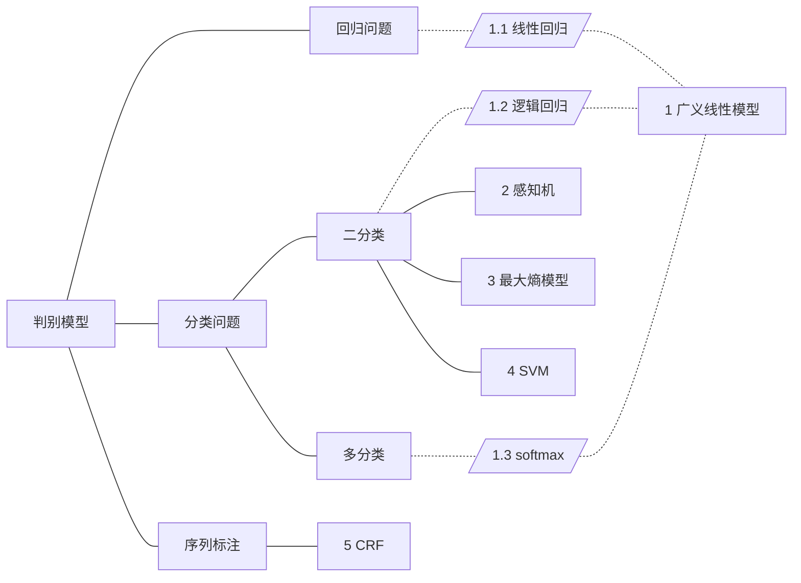

- 按照这个顺序梳理:

```mermaid
graph LR
    H[回归问题]
    F[分类问题]
    X[序列标注]
    P[判别模型] --- H & F & X
    
    F[分类问题] --- two[二分类] & multi[多分类]
    H -.- linear[/1.1 线性回归/]
    two -.- L[/1.2 逻辑回归/]
    two --- G[2 感知机] & Z[3 最大熵模型] & SVM[4 SVM]
    multi -.- S[/1.3 softmax/]
    X --- CRF[5 CRF]

    linear & L & S -.- T[1 广义线性模型]

```