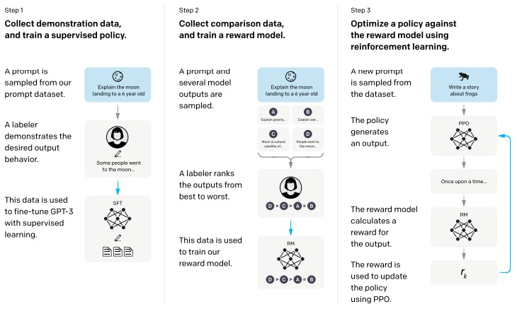

# instructGPT
- paper: https://arxiv.org/pdf/2203.02155v1.pdf
- 针对GPT-3存在的问题，在预训练好的模型上做了`fine-tuning`
    > 用户给出一些`prompt`，有时候模型不能很好地理解用户意图，论文中称`语言模型`与`用户意图`没有对齐
- 所做的工作可以用这个图来概括:

     

## 其实就是做了两步微调，`SFT`、`RLHF`，分别来看看:

### 1、SFT (Supervised fine-tuning)
1. 数据集
    - 收集了13K个**prompt**，并由人工直接给出理想的**output**
2. fine-tuning
    - 使用这个数据集，直接对GPT-3做微调，对应上图中的`Step1`

### 2、RLHF (Reinforcement Learning from Human Feedback)
1. 准备工作，单独训练一个模型来模拟**Human Feedback**，对应上图中的`Step2`
    1. 数据集
        - 收集33k个**prompt**，每个**prompt**，由**SFT**微调过的模型输出9个**output**，然后人工标注，对这9个做一个排序
    2. 输入输出
        - 给定一个**prompt**(即x)和对应的**output**(即y)，模型输出一个打分，记作 $r_\theta(x,y)$
    3. 训练
        - 其实就是训练一个单独的排序模型，论文中叫做Reward Model. (强化学习中的概念)
        - 损失函数 使用排序模型中的 pair-wise的损失函数
    
2. **强化学习**，对应上图中的`Step3`
    1. 数据集
        - 收集31k个**prompt**
    2. **强化学习**中的一些概念
        1. 准备好一个**input**，即**强化学习**中的一个 状态(`state`)，生成下一个词，即**强化学习**中的一个 动作(`action`)
        2. 一个**prompt**，生成一个**response**，对应**强化学习**中的一个 轨迹$\tau$ (`trajectory`)
            - $ s_1 - a_1 \to s_2 - a_2 \to \dots \to s_n $

            |语言模型中的概念|强化学习中的概念|
            |---|---|
            |**prompt**作为**input**|$s_1$|
            |生成下一个词|$a_1$|
            |**input**+已生成的词 = 新的**input**|$s_2$|
            |继续生成下一个词|$a_2$|
            |...|...|
            |**prompt** + **response**|$s_n$|
            
        3. 由某一组参数确定的一个模型，对应**强化学习**中的一组策略，记作 $\pi_\phi$
            > 给定一组参数，指定input生成下一个词 的概率就确定了，也即state--->action的概率
        4. `Step2`中得到的 $r_\theta(x,y)$，对应**强化学习**中，状态 $s_n$ 的奖励值 $r(s_n)$
            > 给出多个**prompt** $[x^{(1)}, x^{(2)}, \dots, x^{(m)}]$  
            > 对应生成多个**reponse** $[y^{(1)}, y^{(2)}, \dots, y^{(m)}]$  
            > 也就会有m个奖励值 $[s^{(1)}_n, s^{(2)}_n, \dots, s^{(m)}_n]$
        5. 最终的学习目标，最大化 $r(s_n)$ 的期望，即 $r_\theta(x,y)$ 的期望
           - $r_\theta(x,y)$的期望，记作 $E_{(x,y) \sim D_{\pi_\phi}} [r_\theta(x,y)]$
    3. 训练
        - 强化学习中的一次**策略迭代**，也就对应着语言模型中的一次**参数更新**
        - 优化算法使用`PPO算法`
        - 在SFT微调后的GPT-3上，继续更新模型参数
          