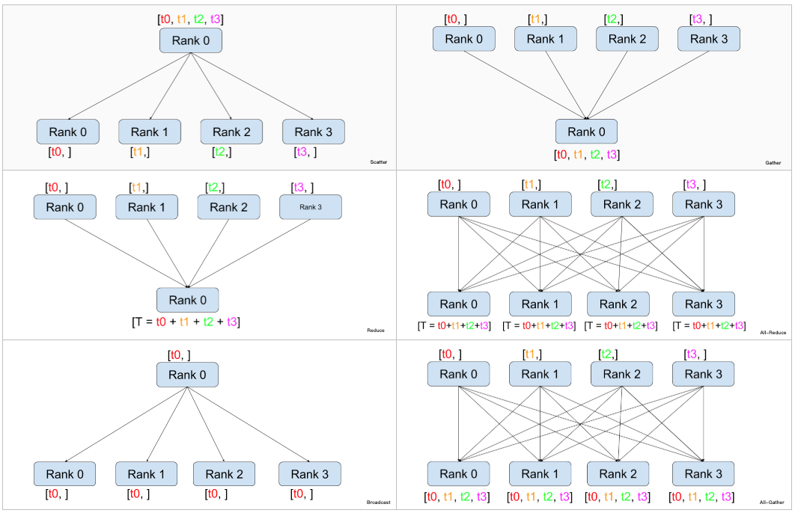

# 几种通信方式

## 一、示意图
> 参考博客: https://www.cnblogs.com/rossiXYZ/p/15546837.html  
    

## 二、Ring-AllReduce
> 参考博客: https://zhuanlan.zhihu.com/p/617133971

- 更高效的实现了`All-Reduce`的效果，计算过程分为两个阶段
    1. Reduce-Scatter
    2. All-Gather