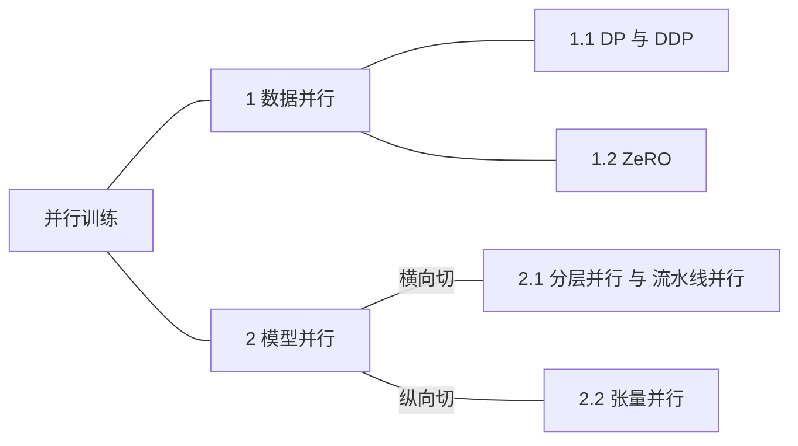

# 并行训练

- 按照这个顺序梳理:

1. 数据并行
    1. [DP&DDP](LLM/并行训练/DP&DDP.md)
        - 从`Data Parallel`到`Distributed Data Parallel`
    2. [ZeRO](LLM/并行训练/ZeRO.md)
        - 在DDP的基础上，进一步降低显存占用
2. [ ] 模型并行
    1. [ ] [分层并行与流水线并行](LLM/并行训练/分层并行与流水线并行.md)
        - 将模型横向切分，不同的层放在不同的GPU
    2. [ ] [张量并行](LLM/并行训练/张量并行.md)
        - 将模型纵向切分，将tensor切分为多块，放在不同的GPU
