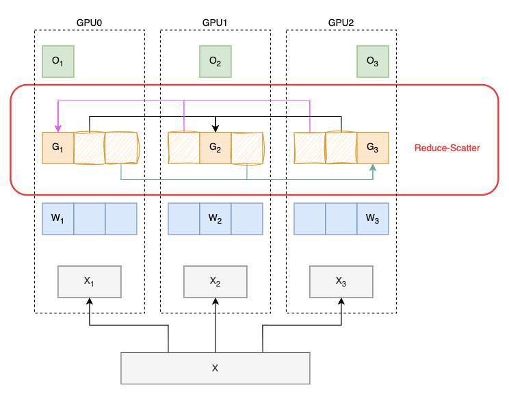

# ZeRO

> paper: [ZeRO](https://arxiv.org/abs/1910.02054v3)


## 一、理论介绍
> 参考: https://zhuanlan.zhihu.com/p/618865052

### 1.1 DDP流程回顾
1. 每块GPU上加载一个完整的模型
2. 假设我们有3卡，将一个batch的数据分成3份，每块GPU拿到一份数据后，做自己的forward、backward，并计算自己的梯度
3. 几个GPU之间，对梯度做一次**all-reduce**(`reduce-scatter`+`all-gather`)

    <details>
    <summary>示意图</summary>

    

    </details>

4. 每个GPU上执行自己的参数更新

> 整个流程中，每块GPU都保存着完整的`模型参数`、`梯度`、`优化器状态`


### 1.2 ZeRO

- 为了进一步降低显存占用，将`模型参数`、`梯度`、`优化器状态`都拆分为多份，每块GPU上仅保存自己需要的那份。

<details>
<summary>例如模型有12层，拆分为3份，示意图</summary>


> - $W_1、G_1、O_1$ 对应模型的`0-3`层
> - $W_2、G_2、O_2$ 对应模型的`4-7`层
> - $W_3、G_3、O_3$ 对应模型的`8-12`层

</details>

#### 1.2.1 stage1
1. 每块GPU上加载一个完整的模型
2. 每块GPU拿到一份数据后，做自己的forward、backward，并计算自己的梯度
3. 几个GPU之间，对梯度做一次`reduce-scatter`，每个GPU上能获取到一部分`完整梯度`

    <details>
    <summary>示意图</summary>

    

    </details>

4. 每个GPU上只有一部分`O`，经过上一步获取对应的`G`后，就可以对相应的`W`进行参数更新
5. 对`W`做一次`all-gather`

#### 1.2.2 stage2

1. 每块GPU上加载一个完整的模型
2. 每块GPU拿到一份数据后，做自己的forward
3. backward
    1. `8-11`层，backward，对`G3`做一次`reduce`，然后**GPU0**、**GPU1**就可以将`G3`部分释放掉
        <details>
        <summary>示意图</summary>

        

        </details>
    2. `4-7`层，backward，对`G2`做一次`reduce`，然后**GPU0**、**GPU2**就可以将`G2`部分释放掉
        <details>
        <summary>示意图</summary>

        

        </details>
    3. `0-3`层，backward，对`G1`做一次`reduce`，然后**GPU1**、**GPU2**就可以将`G1`部分释放掉
        <details>
        <summary>示意图</summary>

        

        </details>
4. 每个GPU上只有一部分`O`、`G`，对相应的`W`进行参数更新
5. 对`W`做一次`all-gather`

#### 1.2.3 stage3
> 每块GPU上不再加载模型所有的参数，仅保存部分参数，只在必要的时候才去读取并完成相应工作

1. 每块GPU上保存部分参数
2. forward
    1. 对`W1`做一次`broadcast`，`0-3`层进行forward，然后GPU将不需要自己维护的`W1`释放
        <details>
        <summary>示意图</summary>

        

        </details>
    2. 对`W2`做一次`broadcast`，`4-7`层进行forward，然后GPU将不需要自己维护的`W2`释放
    3. 对`W3`做一次`broadcast`，`8-11`层进行forward，然后GPU将不需要自己维护的`W3`释放
3. backward
    1. 对`W3`做一次`broadcast`，`8-11`层进行backward，然后对`G3`做一次`reduce`，最后释放不需要的资源
        <details>
        <summary>示意图</summary>

        

        </details>
    2. 对`W2`做一次`broadcast`，`4-7`层进行backward，然后对`G2`做一次`reduce`，最后释放不需要的资源
    3. 对`W1`做一次`broadcast`，`0-3`层进行backward，然后对`G1`做一次`reduce`，最后释放不需要的资源
4. 每个GPU上只有一部分`O`、`G`、`W`，对自己维护的这部分`W`进行参数更新
5. ~~对`W`做一次`all-gather`~~，这里不再需要任何操作

### 1.3 `ZeRO_3`的动态演示:

<video controls width="800">
  <source src="https://www.microsoft.com/en-us/research/wp-content/uploads/2020/02/Turing-Animation.mp4?_=1" type="video/mp4">
  ZeRO_3.mp4
</video>

## 二、deepspeed
> 使用教程: https://huggingface.co/docs/transformers/main_classes/deepspeed#nontrainer-deepspeed-integration  
> 参考: https://zhuanlan.zhihu.com/p/630734624

<details>
<summary>在代码中使用</summary>

```diff
    # 解析参数
+   parser = argparse.ArgumentParser()
+   parser.add_argument('--deepspeed', type=str)     # deepspeed的配置文件
+   args = parser.parse_args()

    # 解析配置文件
+   from transformers.deepspeed import HfTrainerDeepSpeedConfig
+   hf_deepspeed_config = HfTrainerDeepSpeedConfig(args.deepspeed)
    
    # Accelerate DeepSpeed Plugin
+   from accelerate.utils import DeepSpeedPlugin
+   os.environ["ACCELERATE_USE_DEEPSPEED"] = "true"
+   deepspeed_plugin = DeepSpeedPlugin(hf_ds_config=hf_deepspeed_config)

    # 初始化accelerator
+   from accelerate import Accelerator
+   accelerator = Accelerator(deepspeed_plugin=deepspeed_plugin) 


    model = MyModel()  # 初始化model
-   # 这里不需要再迁移
-   model = model.to(device)  # model迁移到GPU

    # 如果配置文件中未指定optimizer、scheduler，这里不需要任何改动
    optimizer = torch.optim.Adam(model.parameters())  # 初始化optimizer
    # 如果配置文件中指定了optimizer、scheduler，则使用这种方式创建
+   # from accelerate.utils import DummyOptim, DummyScheduler
+   # optimizer = DummyOptim(params=model.parameters())
+   # lr_scheduler = DummyScheduler(optimizer)

    dataloader = DataLoader(train_dataset, batch_size=batch_size)

    # 将model、optimizer、dataloader放在相应设备上
+   model, optimizer, dataloader = accelerator.prepare(model, optimizer, dataloader)

    for epoch in range(num_epochs):
        for x, y_true in dataloader:
            y_pred = model(x)        # 正向传播
            l = loss(y_pred, true)   # 计算损失函数            
-           l.backward()             # 反向传播，计算梯度
+           accelerator.backward(loss)
            optimizer.step()         # 更新参数
            optimizer.zero_grad()    # 最后这里记得要将梯度清零
```

</details>

1. 启动训练
    - 单机单卡
        1. `deepspeed --num_gpus=1 train.py --deepspeed ds_config.json`
        2. 指定GPU: `deepspeed --include localhost:1 train.py --deepspeed ds_config.json`
    - 单机多卡
        1. `torchrun --nproc_per_node=2 train.py --deepspeed ds_config.json`
        2. `deepspeed --num_gpus=2 train.py --deepspeed ds_config.json`
2. ds_config.json
    <details>
    <summary><b>ZeRO-2 Config</b></summary>

    ```json
    {
        "fp16": {
            "enabled": "auto", // true
            "loss_scale": 0,
            "loss_scale_window": 1000,
            "initial_scale_power": 16,
            "hysteresis": 2,
            "min_loss_scale": 1
        },

        "optimizer": {
            "type": "AdamW",
            "params": {
                "lr": 3e-5,
                "betas": [0.8, 0.999],
                "eps": 1e-8,
                "weight_decay": 3e-7
            }
        },

        "scheduler": {
            "type": "WarmupLR",
            "params": {
                "warmup_min_lr": 0,
                "warmup_max_lr": 3e-5,
                "warmup_num_steps": 500
            }
        },

        "zero_optimization": {
            "stage": 2,
            "offload_optimizer": {
                "device": "cpu",
                "pin_memory": true
            }, // 将部分数据(优化器参数、梯度) offload到CPU，降低对显存的需求
            "allgather_partitions": true,
            "allgather_bucket_size": 2e8,
            "overlap_comm": true,
            "reduce_scatter": true,
            "reduce_bucket_size": 2e8,
            "contiguous_gradients": true
        },

        "gradient_accumulation_steps": "auto",
        "gradient_clipping": "auto",
        "steps_per_print": 2000,
        "train_batch_size": "auto",
        "train_micro_batch_size_per_gpu": "auto",
        "wall_clock_breakdown": false
    }

    ```

    </details>