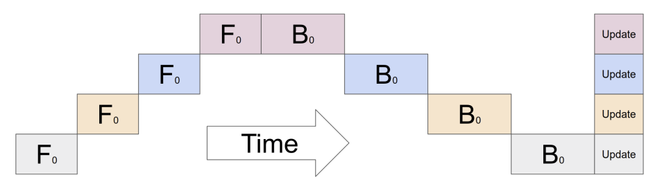
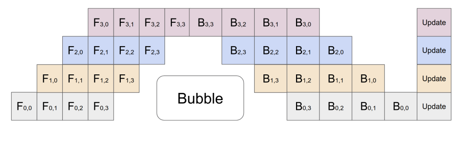
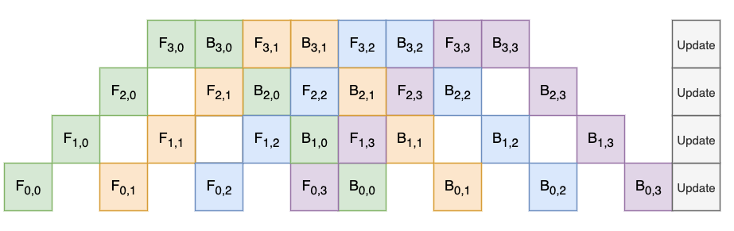

# 从 简单的分层并行 到 流水线并行

> paper: [Gpipe](https://arxiv.org/abs/1811.06965v5)

## 一、分层并行

当我们的模型较大，一块GPU上放不下时，可以使用这种方式。
- 例如模型有32层，每块GPU只能放下8层
    - **GPU0**上放`0-7`
    - **GPU1**上放`8-15`
    - **GPU2**上放`16-23`
    - **GPU3**上放`24-31`

- 模型训练时，示意图如下:

    

    > 在$t_0$时刻，GPU0做forward；t1时刻，GPU1做forward...  
    > 在$t_4$时刻，GPU0做backward；t5时刻，GPU1做backward...  
    > 最后的$t_8$时刻，所有的GPU统一更新梯度  
    > $t_0$至$t_7$，每一时刻只有一个GPU在运行，资源比较浪费

## 二、流水线并行
流水线并行，是在上面的基础上，引入数据并行。即把原先的一个mini_batch，再划分成若干个micro_batch，送入GPU进行训练

- 示意图如下:

    

- 上图中我们有4个GPU，每个mini_batch划分成了4个micro_batch
> 假设我们有K个GPU，每个mini_batch划分成了M个micro_batch  
> Gpipe通过实验证明，当M>=4K时，图中的bubble部分占比很小，可忽略不计

## 三、deepspeed中的实现
> 参考代码: https://github.com/deepspeedai/DeepSpeed/blob/master/deepspeed/runtime/pipe/schedule.py
    >> 函数: TrainSchedule/steps

- 示意图如下:

    

    > 1. 每一行仍然代表一块GPU需要做的事，为了看起来更直观，将一个micro_batch的相关操作标记为一个颜色
    > 2. bubble部分与之前相比，没有变化，只是将backward的时机尽可能提前了
    > 3. 尽早完成backward，就可以尽快释放相应资源

## 四、在代码中使用
- todo