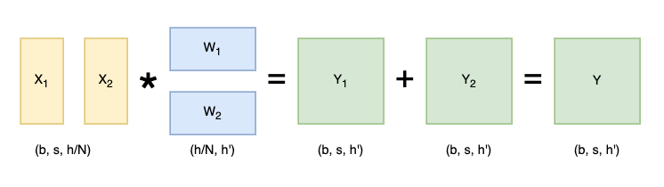
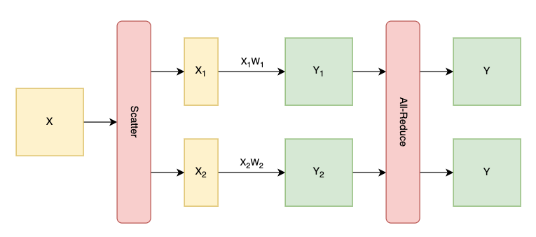
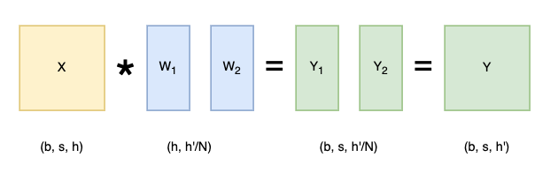
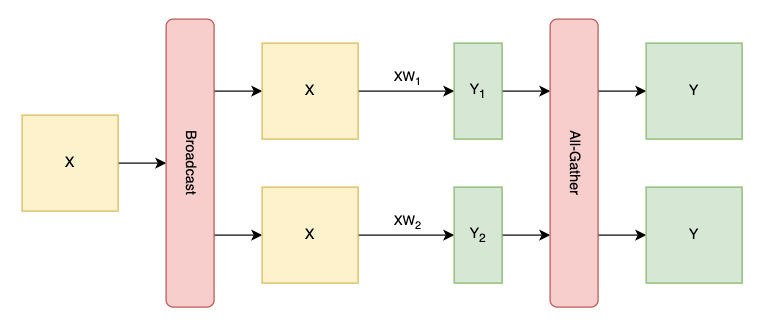
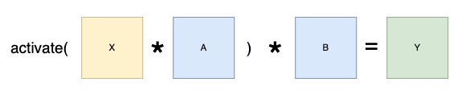
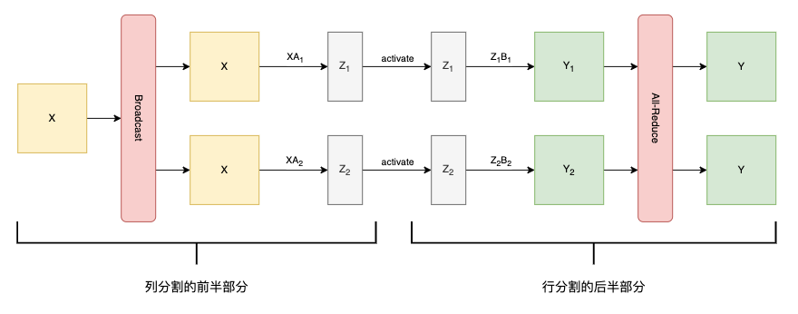
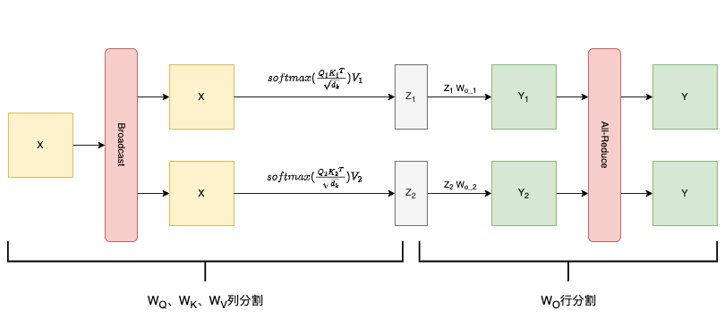
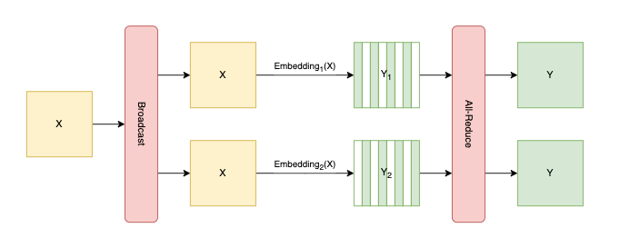
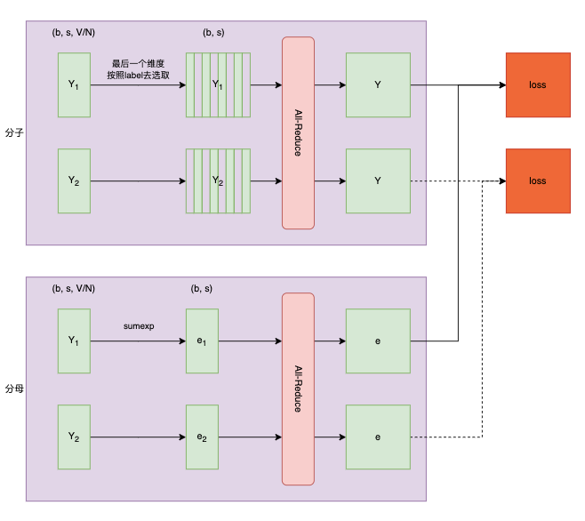
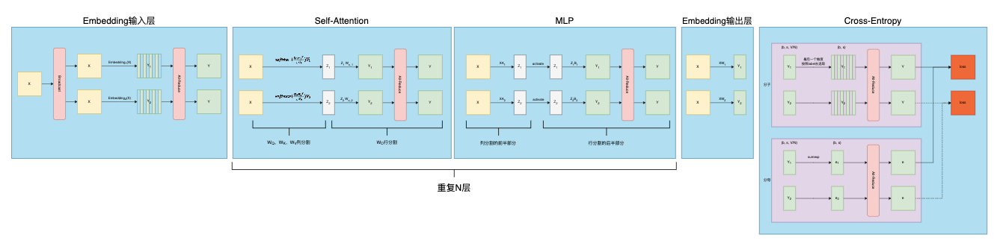

# 张量并行

> paper: [Megatron](https://arxiv.org/abs/1909.08053v4)  
> 参考文章: https://zhuanlan.zhihu.com/p/622212228

## 一、切分权重

> 先了解一下对于线性层，简单的矩阵乘法，我们怎么切分

### 1.1 按行切分权重

<details>
<summary>示意图</summary>
    


</details>

<details>
<summary>代码流程图</summary>
    


</details>

<details>
<summary>代码示例</summary>
    
```python
class RowParallelLinear(torch.nn.Module):

    # 这里负责对W矩阵进行切分
    def __init__(self, input_size, output_size):
        world_size = get_tensor_model_parallel_world_size() # 有几张卡执行TP，对应示意图中的 N
        self.input_size_per_partition = divide(input_size, world_size) # 对应示意图中的 h/N
        self.weight = Parameter(
            torch.empty(self.output_size, self.input_size_per_partition)
        )

    # 这里对应代码流程图
    def forward(self, input_):
        # scatter
        input_parallel = scatter_to_tensor_model_parallel_region(input_)
        # 计算自己卡上那部分
        output_parallel = F.linear(input_parallel, self.weight)
        # reduce
        output = reduce_from_tensor_model_parallel_region(output_parallel)

        return output

```

</details>

### 1.2 按列切分权重

<details>
<summary>示意图</summary>
    


</details>

<details>
<summary>代码流程图</summary>
    


</details>

<details>
<summary>代码示例</summary>
    
```python
class ColumnParallelLinear(torch.nn.Module):

    # 这里负责对W矩阵进行切分
    def __init__(self, input_size, output_size):
        world_size = get_tensor_model_parallel_world_size() # 有几张卡执行TP，对应示意图中的 N
        self.output_size_per_partition = divide(output_size, world_size) # 对应示意图中的 h'/N
        self.weight = Parameter(
            torch.empty(self.output_size_per_partition, self.input_size)
        )
    
    # 这里对应代码流程图
    def forward(self, input_):
        # 将input_复制到所有卡，做一次broadcast
        input_parallel = copy_to_tensor_model_parallel_region(input_)
        # 计算自己卡上那部分
        output_parallel = F.linear(input_parallel, self.weight)
        # gather
        output = gather_from_tensor_model_parallel_region(output_parallel)

        return output
```

</details>

## 二、MLP层

<details>
<summary>示意图</summary>
    


</details>

<details>
<summary>代码流程图</summary>
    


</details>

## 三、Self-Attention层
- attention层有多个head，head之间的计算互不干扰，所以将不同的head放在不同的GPU上即可
    - 具体实现上，我们只需把$W_Q$、$W_K$、$W_V$按列分割，然后每个GPU上去计算自己那部分$softmax(\frac {Q K^T} {\sqrt {d_k}}) V$
        > 例如我们有4张卡做TP，模型的attention层有8个head  
        > $W_Q$、$W_K$、$W_V$按列分割后，相当于`0、1`两个head在`GPU0`计算，`2、3`两个head在`GPU1`计算，...
- 最后的$W_O$矩阵，再按行分割即可(参照**MLP**的B矩阵)

<details>
<summary>代码流程图</summary>
    


</details>

## 四、Embedding层

<details>
<summary>输入层代码流程图</summary>
    


</details>

<details>
<summary>输出层代码流程图</summary>

> 输出层比较简单，与**1.2 按列切分权重**完全一致


</details>

## 五、Cross-Entropy层

<details>
<summary>代码流程图</summary>
    


</details>

## 概览



- 前面介绍每一层的时候，都需要先对输入做`broadcast`
- 所有层拼接在一起后，由于每一层的输出均做了`all-reduce`，于是就可以直接传入下一层继续计算，不需要~~`broadcast`~~
- 训练过程中，**forward**时的通信情况如下:
    ||Embedding输入层|Self-Attention|MLP|Embedding输出层|Cross-Entropy|
    |---|---|---|---|---|---|
    |broadcast|1次<br>--也就是将输入数据放在每张卡上|||||
    |all-reduce|1次|1次|1次||3次|