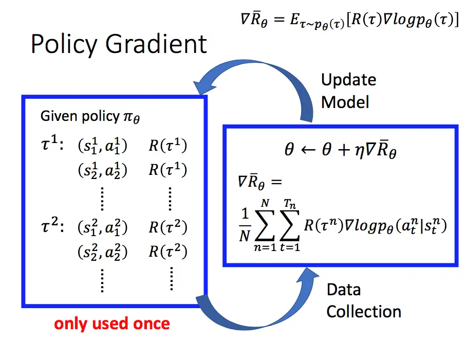
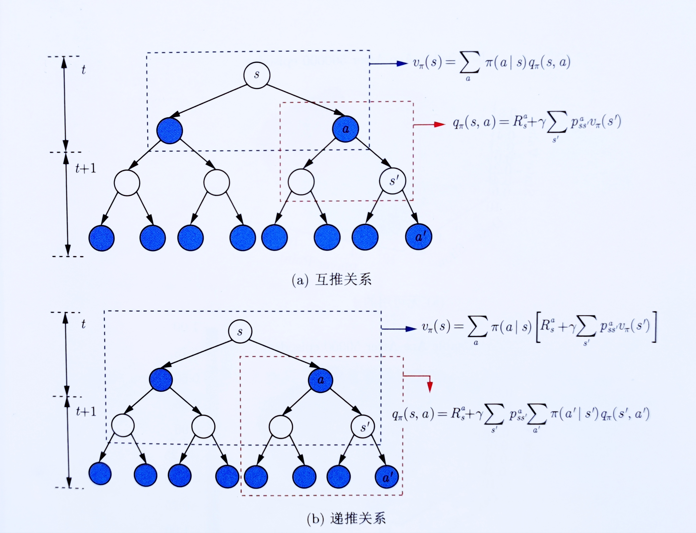
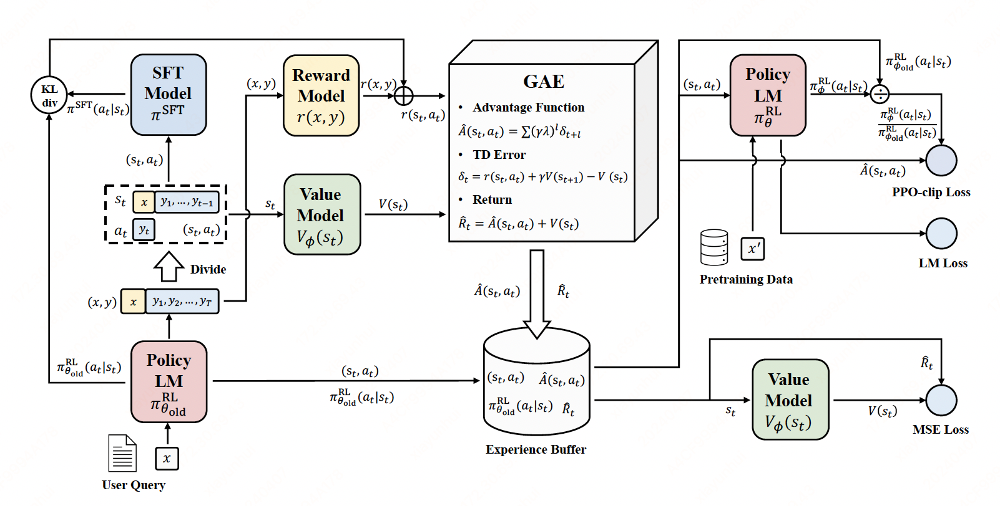

# PPO

> 参考代码: https://github.com/huggingface/trl/blob/main/trl/trainer/ppo_trainer.py  
> 参考博客1: https://newfacade.github.io/notes-on-reinforcement-learning/17-ppo-trl.html  
> 参考博客2: https://blog.csdn.net/v_JULY_v/article/details/128579457  
> 参考博客3: https://blog.csdn.net/v_JULY_v/article/details/128965854  

## 一、Policy Gradient
1. 给定一个策略 $\pi_\theta$，我们可以使用 $\pi_\theta$ 来生成一系列 $\tau^1、\tau^2、...、\tau^N$，然后计算 $\pi_\theta$ 所能获得的期望奖励
    $$
    \bar{R}_\theta = E_{\tau \sim \pi_\theta} [R(\tau)] = \sum\limits_{\tau} R(\tau) p_\theta (\tau)
    $$
    - $R(\tau)$ 可以由奖励模型给出
    - $ p_\theta (\tau) = p(s_1)p_\theta(a_1|s_1)p(s_2|s_1,a_1)p_\theta(a_2|s_2)p(s_3|s_2,a_2)... = p(s_1) \prod\limits_{t=1}^T p_\theta(a_t|s_t)p(s_{t+1}|s_t, a_t) $
2. 我们的优化目标，就是 $\max\limits_\theta \bar{R}_\theta$
3. 于是对$\bar{R}_\theta$求导，便可得到(1)式:
    $$
    \nabla \bar{R}_\theta = \frac 1 N \sum\limits_{n=1}^N \sum\limits_{t=1}^{T_n} R(\tau^n) \nabla \log p_\theta(a^n_t|s^n_t) \qquad (1)
    $$
    <details>
    <summary>详细求导过程</summary>

    $$
    \begin{aligned}
    \nabla \bar{R}_\theta & = \sum\limits_{\tau} R(\tau) \nabla p_\theta (\tau) & \\
    & = \sum\limits_{\tau} R(\tau) p_\theta (\tau) \frac {\nabla p_\theta (\tau)} {p_\theta (\tau)} & \\
    & = \sum\limits_{\tau} R(\tau) p_\theta (\tau) \nabla \log {p_\theta (\tau)} & 这里用了公式: \frac {\nabla f(x)} {f(x)} = \nabla \log f(x) \\
    & = E_{\tau \sim \pi_\theta} [R(\tau) \nabla \log {p_\theta (\tau)}] & \\
    & = \frac 1 N \sum\limits_{n=1}^N R(\tau^n) \nabla \log {p_\theta (\tau^n)} & \\
    & = \frac 1 N \sum\limits_{n=1}^N R(\tau^n) \nabla \log \left[ p(s^n_1) \prod\limits_{t=1}^{T_n} p_\theta(a^n_t|s^n_t)p(s^n_{t+1}|s^n_t, a^n_t) \right] &  代入p_\theta (\tau) \\
    & = \frac 1 N \sum\limits_{n=1}^N R(\tau^n) \nabla_\theta \left[ \sum\limits_{t=1}^{T_n} \log p_\theta(a^n_t|s^n_t) \right] & 仅保留与\theta有关的项 \\
    & = \frac 1 N \sum\limits_{n=1}^N R(\tau^n) \left[ \sum\limits_{t=1}^{T_n} \nabla \log p_\theta(a^n_t|s^n_t) \right] & 转换为 先求导再求和 \\
    & = \frac 1 N \sum\limits_{n=1}^N \sum\limits_{t=1}^{T_n} R(\tau^n) \nabla \log p_\theta(a^n_t|s^n_t) & (1)
    \end{aligned}
    $$

    </details>

4. PG的完整过程如下:

    

## 二、PPO

### 2.1、$\nabla \bar{R}_\theta$的改进
- 接下来在上面(1)式的基础上，一步步来改进 $\nabla \bar{R}_\theta$

#### 1) 添加一个baseline
$$
\begin{aligned}
\nabla \bar{R}_\theta & = \frac 1 N \sum\limits_{n=1}^N \sum\limits_{t=1}^{T_n} R(\tau^n) \nabla \log p_\theta(a^n_t|s^n_t) & (1) \\
& \approx \frac 1 N \sum\limits_{n=1}^N \sum\limits_{t=1}^{T_n} [R(\tau^n)-b] \nabla \log p_\theta(a^n_t|s^n_t) & 其中，b \approx E[R(\tau^n)]
\end{aligned}
$$
#### 2) 每个时间步，都拥有一个单独的 $r_t$
- 每一个轨迹 $\tau$，其实是由多个时间步组成的。目前我们对于整个轨迹 $\tau$，都使用一个奖励值 $R(\tau)$
- 其实可以更细致地拆解，每个时刻t，使用不同的奖励值$R_t(\tau)$
    |$s_1$|$s_2$|...|$s_t$|...|$s_T$|在每个时间步t，使用的奖励值$R_t(\tau)$|
    |---|---|---|---|---|---|---|
    |未指定|未指定|未指定|未指定|未指定|$R(\tau)$|$R(\tau)$|
    |$r_1$|$r_2$|...|$r_t$|...|$r_T$|从t时刻到最终T时刻，$r_{t^{\prime}}$ 的一个加权和|
- 具体计算公式为: $R_t(\tau) = \sum\limits_{t^{\prime}=t}^{T} \gamma^{t^{\prime}-t} r_{t^{\prime}}$
- 于是将(1)式进一步改写:
    $$
    \begin{aligned}
    \nabla \bar{R}_\theta & = \frac 1 N \sum\limits_{n=1}^N \sum\limits_{t=1}^{T_n} R(\tau^n) \nabla \log p_\theta(a^n_t|s^n_t) & (1) \\
    & \approx \frac 1 N \sum\limits_{n=1}^N \sum\limits_{t=1}^{T_n} [R_t(\tau^n)-b_t] \nabla \log p_\theta(a^n_t|s^n_t) & 其中，R_t(\tau) = \sum\limits_{t^{\prime}=t}^{T} \gamma^{t^{\prime}-t} r_{t^{\prime}}, b_t \approx E[R_t(\tau^n)] \\
    \end{aligned}
    $$
#### 3)使用优势函数
- 分别来看看$[R_t(\tau^n)-b_t]$中的两项
    1. $R_t(\tau^n) = \sum\limits_{t^{\prime}=t}^{T} \gamma^{t^{\prime}-t} r_{t^{\prime}}$，刻画了从t时刻到最终T时刻，$r_{t^{\prime}}$的一个加权和---->可以用 $Q_{\pi_\theta}(s_t, a_t)$ 来近似替代
    2. $b_t \approx E[R_t(\tau^n)]$，刻画了t时刻的平均奖励值---->可以用 $V_{\pi_\theta}(s_t)$ 来近似替代
- 于是将(1)式进一步改写:
    $$
    \begin{aligned}
    \nabla \bar{R}_\theta & = \frac 1 N \sum\limits_{n=1}^N \sum\limits_{t=1}^{T_n} R(\tau^n) \nabla \log p_\theta(a^n_t|s^n_t) & (1) \\
    & \approx \frac 1 N \sum\limits_{n=1}^N \sum\limits_{t=1}^{T_n} [Q_{\pi_\theta}(s_t, a_t)-V_{\pi_\theta}(s_t)] \nabla \log p_\theta(a^n_t|s^n_t) & \\
    & = \frac 1 N \sum\limits_{n=1}^N \sum\limits_{t=1}^{T_n} A^{\theta}(s_t, a_t) \nabla \log p_\theta(a^n_t|s^n_t) & (2)
    \end{aligned}
    $$
> (2)式中 $A^{\theta}(s_t, a_t)$即为优势函数，再来思考一下它的意义
>    1. $Q_{\pi_\theta}(s, a)$ 刻画了在状态s时，采取动作a后的期望奖励值
>    2. $V_{\pi_\theta}(s_t)$ 刻画了在状态s时的期望奖励值
>    3. 那么它们的差值，就可以用来评估 在状态s时，具体的某个动作a的好坏
>        - $A^{\theta}(s, a) > 0$，采取动作a后，得到的回报比平均值要高，需要增加动作a的概率；反之则降低动作a的概率

### 2.2、重要性采样
- 上面(2)式中 $A^{\theta}(s_t, a_t)$ 是在策略 $\pi_\theta$ 下计算出来的
- 接下来基于重要性采样的原则，从策略 $\pi_\theta$ 换到 策略 $\pi_{\theta^{\prime}}$，对(2)式再做一些变换
    1. 要优化(2)式，等价于优化下式:
        $$
        E_{(s_t,a_t) \sim \pi_\theta} [A^{\theta}(s_t, a_t) \nabla \log p_\theta(a_t|s_t)]
        $$
    2. 将 $A^{\theta}(s_t, a_t)$ 变换成  $A^{\theta^{\prime}}(s_t, a_t)$
        $$
        \begin{aligned}
        & E_{(s_t,a_t) \sim \pi_\theta} \left[ A^{\theta}(s_t, a_t) \nabla \log p_\theta(a_t|s_t) \right] & \\
        = & E_{(s_t,a_t) \sim \pi_{\theta^\prime}} \left[ \frac {p_\theta(s_t,a_t)} {p_{\theta^\prime}(s_t,a_t)} A^{\theta^\prime}(s_t, a_t) \nabla \log p_\theta(a_t|s_t) \right] & \\
        = & E_{(s_t,a_t) \sim \pi_{\theta^\prime}} \left[ \frac {p_\theta(a_t | s_t)} {p_{\theta^\prime}(a_t | s_t)} \frac {p_\theta(s_t)} {p_{\theta^\prime}(s_t)} A^{\theta^\prime}(s_t, a_t) \nabla \log p_\theta(a_t|s_t) \right] & \\
        \approx & E_{(s_t,a_t) \sim \pi_{\theta^\prime}} \left[ \frac {p_\theta(a_t | s_t)} {p_{\theta^\prime}(a_t | s_t)} A^{\theta^\prime}(s_t, a_t) \nabla \log p_\theta(a_t|s_t) \right] & (3) \\
        \end{aligned}
        $$

### 2.3、反推出`目标函数`
- 实际更新参数的时候，我们按照上面的(3)式来更新，于是我们就可以从梯度反推**目标函数**
    $$
    \begin{aligned}
    \nabla_\theta & = E_{(s_t,a_t) \sim \pi_{\theta^\prime}} \left[ \frac {p_\theta(a_t | s_t)} {p_{\theta^\prime}(a_t | s_t)} A^{\theta^\prime}(s_t, a_t) \nabla \log p_\theta(a_t|s_t) \right] & (3) \\
    & = E_{(s_t,a_t) \sim \pi_{\theta^\prime}} \left[ \frac {\nabla p_\theta(a_t | s_t)} {p_{\theta^\prime}(a_t | s_t)} A^{\theta^\prime}(s_t, a_t) \right] & 这里用了公式: \frac {\nabla f(x)} {f(x)} = \nabla \log f(x) \\
    \Longrightarrow J(\theta) & = E_{(s_t,a_t) \sim \pi_{\theta^\prime}} \left[ \frac { p_\theta(a_t | s_t)} {p_{\theta^\prime}(a_t | s_t)} A^{\theta^\prime}(s_t, a_t) \right] & (4) \\
    \end{aligned}
    $$

### 2.4、近端策略优化裁剪PPO-clip
- 引入重要性采样后，我们计算一次 $A^{\theta^\prime}(s_t, a_t)$，就可以进行多次参数更新
- 但这样做有个问题，$p_\theta(a_t | s_t)$ 与 $p_{\theta^\prime}(a_t | s_t)$ 不能相差过大，为了解决这个问题，`PPO2`对(4)式做了裁剪
    1. (4)式可以等价地写为:
        $$
        J(\theta) \approx \frac 1 N \sum\limits_{(s_t, a_t)} \frac {p_\theta(a_t | s_t)} {p_{\theta^\prime}(a_t | s_t)} A^{\theta^\prime}(s_t, a_t)
        $$
    2. clip
        $$
        J_{PPO2}(\theta) \approx \frac 1 N \sum\limits_{(s_t, a_t)} \min \left\{  \frac {p_\theta(a_t | s_t)} {p_{\theta^\prime}(a_t | s_t)} A^{\theta^\prime}(s_t, a_t), clip \left( \frac {p_\theta(a_t | s_t)} {p_{\theta^\prime}(a_t | s_t)}, 1-\varepsilon, 1+\varepsilon \right) A^{\theta^\prime}(s_t, a_t) \right\} \quad (5)
        $$
> 裁剪算法的意义，推导细节见[参考博客3](https://blog.csdn.net/v_JULY_v/article/details/128965854)
>   1. $A^{\theta^\prime}(s_t, a_t) > 0$，说明这个动作好，需要增大 $p_\theta(a_t | s_t)$，但不能太大， $\frac {p_\theta(a_t | s_t)} {p_{\theta^\prime}(a_t | s_t)}$ 最大不能超过 $(1+\varepsilon)$
>   2. $A^{\theta^\prime}(s_t, a_t) < 0$，说明这个动作不好，需减小 $p_\theta(a_t | s_t)$，但不能太小，$\frac {p_\theta(a_t | s_t)} {p_{\theta^\prime}(a_t | s_t)}$ 最小不能低于 $(1-\varepsilon)$

### 2.5、代码实现
> 为计算(5)式，我们需要提前计算好这3项:
>    1. $p_\theta(a_t | s_t)$，即输入参数中的 **logprobs**
>    2. $p_{\theta^\prime}(a_t | s_t)$，即输入参数中的 **old_logprobs**
>    3. $A^{\theta^\prime}(s_t, a_t)$，即输入参数中的 **advantages**

```python
class PPOTrainer(BaseTrainer):
    def loss(
        self,
        logprobs: torch.FloatTensor,
        old_logprobs: torch.FloatTensor,
        advantages: torch.FloatTensor,
    ):

        ratio = torch.exp(logprobs - old_logprobs)

        # 转换为最小化问题，因此前面加负号
        pg_losses = -advantages * ratio
        pg_losses2 = -advantages * torch.clamp(ratio, 1.0 - self.config.cliprange, 1.0 + self.config.cliprange)

        # 相应地，(5)式中的min，对应这里的torch.max()
        pg_loss = masked_mean(torch.max(pg_losses, pg_losses2), mask)

        return pg_loss
```

## 三、GAE
> $p_\theta(a_t | s_t)$、$p_{\theta^\prime}(a_t | s_t)$我们比较熟悉，但是 $A^{\theta^\prime}(s_t, a_t)$ 怎么计算呢？  
> 前面提到 $A(s_t, a_t) = Q(s_t, a_t)-V(s_t)$，于是问题可以转化为如何预测 Q、V

### 3.1、Q、V之间的关系



### 3.2、$R(s_t, a_t)$的设计
> 有了 $R(s_t, a_t)$，即上面图示中的 $R_s^a$，再利用公式 $Q_\pi(s,a) = R_s^a + \gamma \sum\limits_{s^{\prime}} p_{ss^\prime}^a V_\pi(s^\prime) $，我们就可以通过 $V_\pi(s)$ 来计算 $Q_\pi(s,a)$  
> 也就是说，有了 $R(s_t, a_t)$，我们只需要预测 $V_\pi(s)$ 就可以了
- `trl`中的**PPOTrainer**是这样设计的:
    |$R(s_1, a_1)$|$R(s_2, a_2)$|...|$R(s_t, a_t)$|...|$R(s_T, a_T)$|
    |---|---|---|---|---|---|
    |$- \beta KL(1)$|$- \beta KL(2)$|...|$- \beta KL(t)$|...|$- \beta KL(T) + Reward(x,y)$|
    > 其中，$KL(t) = \log \frac {\pi^{RL}_{\theta^\prime}(a_t|s_t)} {\pi^{SFT}(a_t|s_t)}$，Reward(x,y)为奖励模型预测的回报值  
    > 这样的话，$\sum\limits_{t=1}^T R(s_t, a_t) = - \beta \log \frac {\pi^{RL}_{\theta^\prime}(y|x)} {\pi^{SFT}(y|x)} + Reward(x,y)$

<details>
<summary>trl中代码实现</summary>
    
```python
def compute_rewards(
    self,
    scores: torch.FloatTensor,
    logprobs: torch.FloatTensor,
    ref_logprobs: torch.FloatTensor,
    masks: torch.LongTensor,
):
    """
    Compute per token rewards from scores and KL-penalty.
    """
    rewards, non_score_rewards, kls = [], [], []
    for score, logprob, ref_logprob, mask in zip(scores, logprobs, ref_logprobs, masks):
        # compute KL penalty (from difference in logprobs)
        kl = self._kl_penalty(logprob, ref_logprob)
        kls.append(kl)
        non_score_reward = -self.kl_ctl.value * kl
        non_score_rewards.append(non_score_reward)
        reward = non_score_reward.clone()
        last_non_masked_index = mask.nonzero()[-1]

        # reward is preference model score + KL penalty
        reward[last_non_masked_index] += score
        rewards.append(reward)
    return torch.stack(rewards), torch.stack(non_score_rewards), torch.stack(kls)

def _kl_penalty(self, logprob: torch.FloatTensor, ref_logprob: torch.FloatTensor) -> torch.FloatTensor:
    if self.config.kl_penalty == "kl":
        return logprob - ref_logprob
```

</details>

### 3.3、$V_\pi(s)$ 的预测

#### 1) 蒙特卡洛方法(MC)

1. 首先，我们有了$R(s_t, a_t)$的计算方式，对于每个轨迹$\tau$，可以先计算对应的$R_t$
    |时刻t|1|2|...|t|...|$R(s_{T-1}, a_{T-1})$|$R(s_T, a_T)$|
    |---|---|---|---|---|---|---|---|
    |$R_t$|$- \beta KL(1)$|$- \beta KL(2)$|...|$- \beta KL(t)$|...|$- \beta KL(T-1)$|$- \beta KL(T) + Reward(x,y)$|
2. 然后，根据$R_t$，计算每个状态可以得到的回报，记作$G_t$
    |时刻t|1|2|...|t|...|$R(s_{T-1}, a_{T-1})$|$R(s_T, a_T)$|
    |---|---|---|---|---|---|---|---|
    |$R_t$|$- \beta KL(1)$|$- \beta KL(2)$|...|$- \beta KL(t)$|...|$- \beta KL(T-1)$|$- \beta KL(T) + Reward(x,y)$|
    |$G_t$|$R_1 + \gamma G_2$|$R_2 + \gamma G_3$|...|$R_{t} + \gamma G_{t+1}$|...|$R_{T-1} + \gamma G_T$|$R_T$|
3. 当我们有多个轨迹 $\tau$ 时，对于每个状态s，就可以计算出多个 $G_t$ 值，取平均值，便得到了 $V_t$
    |时刻t|1|2|...|t|...|$R(s_{T-1}, a_{T-1})$|$R(s_T, a_T)$|
    |---|---|---|---|---|---|---|---|
    |$R_t$|$- \beta KL(1)$|$- \beta KL(2)$|...|$- \beta KL(t)$|...|$- \beta KL(T-1)$|$- \beta KL(T) + Reward(x,y)$|
    |$G_t$|$R_1 + \gamma G_2$|$R_2 + \gamma G_3$|...|$R_{t} + \gamma G_{t+1}$|...|$R_{T-1} + \gamma G_T$|$R_T$|
    |$V(s_t)$|$E(G_1)$|$E(G_2)$|...|$E(G_t)$|...|$E(G_{T-1})$|$E(G_T)$|
4. 实际计算
    > 但是我们实际计算的时候，无法一次生成很多$\tau$，使它能够覆盖很多$s_t$，再取求均值  
    - 实际计算时，参考**随机梯度下降**的做法，我们只需生成一次$\tau$，采用下式进行参数更新:
        $$
        V(s_t) \leftarrow V(s_t) + \alpha [G_t-V(s_t)] \qquad (6)
        $$
    - 这样 $V(s_t)$ 就会跟 $G_t$ 越来越接近

#### 2) 时序差分(TD)
- 时序差分中，则是想让 $V(s_t)$ 与 $R_t + \gamma V(s_{t+1})$ 越来越接近，参数更新公式如下:
    $$
    V(s_t) \leftarrow V(s_t) + \alpha [ \underbrace{R_t+ \gamma V(s_{t+1})}_{对应(6)式中的G_t} - V(s_t)] \qquad (7)
    $$
> 用 更可靠的估计 取代 现有估计
>   - $V(s_t)$ 是现有估计
>   - $R_t+ \gamma V(s_{t+1})$ 中多了真实值 $R_t$，是更可靠的估计
>   - 所以**时序差分**不断用更可靠的估计，来取代现有估计，慢慢接近真实值

#### 3) GAE
> 如果采用MC来预测 $V(s_t)$, 那么优势函数 $A(s_t, a_t)$ 就对应(6)式中的 $G_t-V(s_t)$  
> 如果采用TD来预测 $V(s_t)$, 那么优势函数 $A(s_t, a_t)$ 就对应(7)式中的 $R_t + \gamma V(s_{t+1}) - V(s_t)$

- GAE将两者结合起来，计算过程如下:
    1. 按照TD中的方式，计算$\delta_t = R_t + \gamma V(s_{t+1}) - V(s_t)$
    2. $A(s_t, a_t) = \sum\limits_{l=0}^{\infty} (\gamma \lambda)^l {\delta}_{t+l}$
    > 1. $\lambda=0$: $A(s_t, a_t) = R_t + \gamma V(s_{t+1}) - V(s_t)$，等价于TD
    > 2. $\lambda=1$: $A(s_t, a_t) = \sum\limits_{l=0}^{\infty} \gamma^l R_{t+l} - V(s_t) = (R_t + \gamma R_{t+1} + \gamma^2 R_{t+2} + ...) - V(s_t) = G_t-V(s_t)$，等价于MC
- 所以**GAE**是通过参数 $\lambda$ 将**MC**和**TD**结合起来，做一个权衡
- 对照上面的(6)、(7)式，GAE中的参数更新公式可写为:
    $$
    \begin{aligned}
    V(s_t) & \leftarrow V(s_t) + \alpha [A(s_t, a_t)] \\
    & \leftarrow V(s_t) + \alpha [ \underbrace{A(s_t, a_t)+V(s_t)}_{对应(6)式中的G_t} - V(s_t)]
    \end{aligned}
    $$
- 由上式可知，GAE中，随着参数更新，$V(s_t)$ 与 $\underbrace{A(s_t, a_t)+V(s_t)}$ 越来越接近

<details>
<summary>trl中代码实现</summary>
    
```python
for t in reversed(range(gen_len)):
    nextvalues = values[:, t + 1] if t < gen_len - 1 else 0.0
    delta = rewards[:, t] + self.config.gamma * nextvalues - values[:, t]
    lastgaelam = delta + self.config.gamma * self.config.lam * lastgaelam
    advantages_reversed.append(lastgaelam)
advantages = torch.stack(advantages_reversed[::-1]).transpose(0, 1)

# returns即为期望的预测值
returns = advantages + values
```

</details>

## 四、Actor-Critic架构
> 至此，我们的训练任务划分成两个:
>    1. 如何采取更好的动作 ----> actor
>    2. 如何预测 $V(s_t)$ ----> critic

- 对于一个策略模型 $\pi_{\theta^\prime}$，我们可以生成轨迹 $\tau$，然后计算$R_t$:
    |时刻t|1|2|...|t|...|$R(s_{T-1}, a_{T-1})$|$R(s_T, a_T)$|
    |---|---|---|---|---|---|---|---|
    |$R_t$|$- \beta KL(1)$|$- \beta KL(2)$|...|$- \beta KL(t)$|...|$- \beta KL(T-1)$|$- \beta KL(T) + Reward(x,y)$|
- 然后，引入一个value_model，$V_{\theta^\prime}$来预测每个状态下的$V(s_t)$，就可以计算这些值：
    |时刻t|1|2|...|t|...|$R(s_{T-1}, a_{T-1})$|$R(s_T, a_T)$|
    |---|---|---|---|---|---|---|---|
    |$R_t$|$- \beta KL(1)$|$- \beta KL(2)$|...|$- \beta KL(t)$|...|$- \beta KL(T-1)$|$- \beta KL(T) + Reward(x,y)$|
    |$V(s_t)$|$V_{\theta^\prime}(s_1)$|$V_{\theta^\prime}(s_2)$|...|$V_{\theta^\prime}(s_t)$|...|||
    |$\delta_t$||||$R_t + \gamma V_{\theta^\prime}(s_{t+1}) - V_{\theta^\prime}(s_t)$||||
    |$A^{\theta^\prime}(s_t, a_t)$||||$\sum\limits_{l=0}^{\infty} (\gamma \lambda)^l {\delta}_{t+l}$||||
    |$V(s_t)$ 的期望值||||$A^{\theta^\prime}(s_t, a_t)+V_{\theta^\prime}(s_t)$||||

### 优化目标
1. actor网络的优化目标，就是前面2.4节的(5)式:
    $$
    J_{PPO2}(\theta) \approx \frac 1 N \sum\limits_{(s_t, a_t)} \min \left\{  \frac {p_\theta(a_t | s_t)} {p_{\theta^\prime}(a_t | s_t)} A^{\theta^\prime}(s_t, a_t), clip \left( \frac {p_\theta(a_t | s_t)} {p_{\theta^\prime}(a_t | s_t)}, 1-\varepsilon, 1+\varepsilon \right) A^{\theta^\prime}(s_t, a_t) \right\} \quad (5)
    $$
2. critic网络的优化目标，是 $V_\theta(s_t)$ 更接近于 $A^{\theta^\prime}(s_t, a_t)+V_{\theta^\prime}(s_t)$，因此损失函数可以写为:
    $$
    J(\theta) = \frac 1 N \sum \frac 1 2 \left\{ V_\theta(s_t) - [A^{\theta^\prime}(s_t, a_t)+V_{\theta^\prime}(s_t)] \right\}^2
    $$

## 五、整体训练框架
- 至此，便理清了PPO的训练流程，可以完整地过一遍[参考代码](https://github.com/huggingface/trl/blob/main/trl/trainer/ppo_trainer.py)，更清洗地认识整个架构
- 如[参考博客1](https://newfacade.github.io/notes-on-reinforcement-learning/17-ppo-trl.html)中的这张图所示:

    