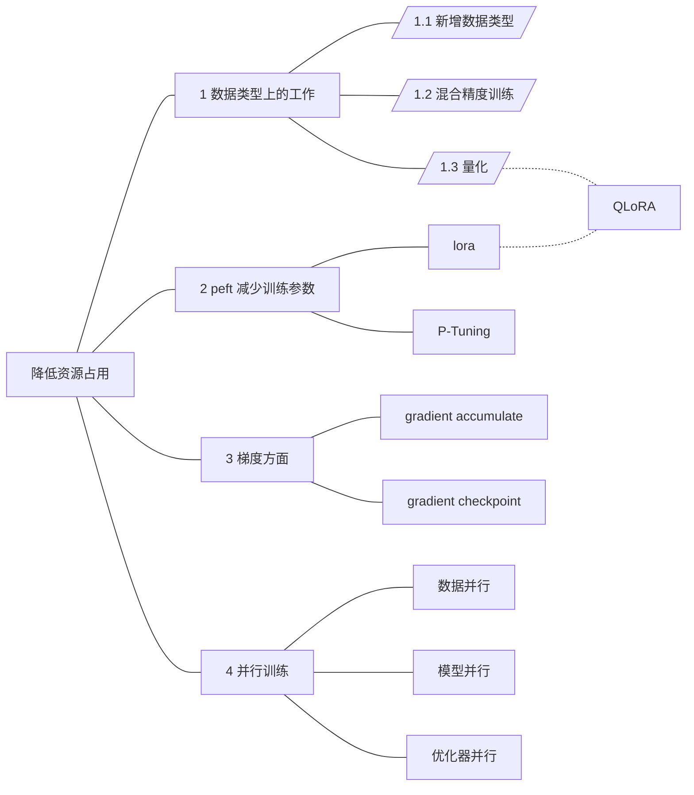

# 如何降低资源占用？

> 随着模型规模扩大，需要寻找各种方法来减少资源需求

- 按照这个顺序梳理:

<b>一、数据类型上的工作</b>

1. 新的数据类型
    |数据类型||备注|
    |---|---|---|
    |FP32|float32|全精度(4bytes)|
    |FP16|float16|半精度(2bytes)|
    |BF16|bfloat16|半精度(2bytes)|
    |...|||
2. [混合精度训练](LLM/降低资源占用/混合精度训练.md)
    - 部分操作使用FP16，部分操作使用FP32
3. [量化(quantization)](LLM/降低资源占用/量化.md)
    - 进一步压缩，使用1byte来存储参数

<b>二、减少训练参数</b>

1. [peft](LLM/降低资源占用/peft.md)
    - 模型主体部分的参数不变，只添加少量adapter，通过微调这部分参数，来达到微调整个模型的效果
    - 目前常用的两种方式
        1. lora [paper](https://arxiv.org/abs/2106.09685)
        2. P-Tuning v2
2. QLoRA
    - 两种方式的融合: `Quantization` + peft中的`lora`方式

<b>三、梯度方面</b>

1. gradient accumulate
    - 多个batch前向传播，计算loss后，累加在一起，再进行反向传播
2. gradient checkpoint
    - 显存占用，激活函数占大头，以`bert-base`为例，model占用2%，optimizer占用10%，激活函数占用87.6%
    - 解决方式：时间换空间，又称 激活函数重演(rematerialization)

<b>四、并行训练</b>

1. [x] 数据并行 (Data Parallelism)
2. [ ] 模型并行
    1. 简单的模型并行 (分层)
    2. 流水线并行 [Gpipe](https://arxiv.org/abs/1811.06965v5)
    3. 张量并行 [Megatron-LM](https://arxiv.org/abs/1909.08053v4)
3. [ ] 优化器并行 [ZeRO](https://arxiv.org/abs/1910.02054v3)

