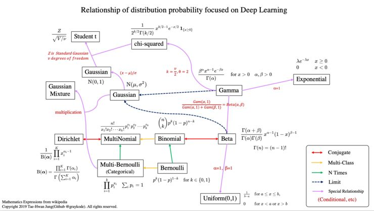

# 常见概率分布
python实现，参考Git: https://github.com/graykode/distribution-is-all-you-need

## 一、均匀分布(uniform)

## 二、伯努利分布(bernoulli)
- 抛1次硬币，正面朝上的概率  
$$
P(X=x;\theta) = \theta^x{(1-\theta)}^{1-x}\\
x \in \{0, 1\}
$$
或者:
$$
P(X = x;\theta) =
\begin{cases}
1-\theta,&x=0\\
\theta, &x=1
\end{cases}
$$

## 三、二项分布(binormial)
- 抛n次硬币，正面朝上出现了k次的概率  
$$
P(X = k;n,p) = C_n^kp^k{(1-p)}^{n-k}\\
k \in \{0,1,2,...,n\}
$$

## 四、多类别分布(categorical)
- 抛1次骰子，第k面朝上的概率
- 相比bernoulli，X的取值可能有K个
$$
P(X=x_k;\theta_1,\theta_2,...,\theta_K) = \prod\limits_{k=1}^K\theta_k^{x_k}\\
\sum\limits_{k=1}^K \theta_k = 1\\
x_k \in \{0, 1\}, \sum\limits_{k=1}^K x_k = 1
$$
例如:
$$
P(X = x;\theta_1,\theta_2,\theta_3) = 
\begin{cases}
{\theta_1 = 0.1}, &x_1=0\\
{\theta_2 = 0.6}, &x_2=1\\
{\theta_3 = 0.3}, &x_3=2
\end{cases}
$$

## 五、多项式分布(multinomial)
- 抛n次骰子，第1面朝上$m_1$次，第2面朝上$m_2$次，第3面朝上$m_3$次...
$$
\begin{aligned}
P(X_1=m_1,X_2=m_2,...,X_K=m_K;\theta_1,\theta_2,...\theta_K,n) &= C_n^{m_1}C_{n-m_1}^{m_2}...C_{n-m_1-m_2-...-m_{k-1}(=m_k)}^{m_k}\prod\limits_{k=1}^K \theta_k^{m_k}\\
&= \frac {n!} {m_1!m_2!...m_K!} \prod\limits_{k=1}^K \theta_k^{m_k}
\end{aligned}\\
\sum\limits_{k=1}^K \theta_k = 1\\
\sum\limits_{k=1}^K m_k = n
$$

## 六、$\beta$分布(beta)

## 七、Dirichlet分布(Dirichlet)

## 八、$\gamma$分布(gamma)

## 九、指数分布(exponential)
- $\gamma$分布的特例
$$
P(X=x;\lambda) = \lambda e^{-\lambda x}, x>0
$$

## 十、高斯分布(gaussian)
$P(X=x;\mu,\sigma) = \frac 1 {\sqrt{2\pi} \sigma} e^{-\frac {{(x-\mu)}^2} {2\sigma^2}}$

## 十一、正态分布(normal)
- 即 标准高斯分布，$\mu=0, \sigma=1$

## 十二、卡方分布(chi-squared)
- $\gamma$分布的特例

## 十三、$\tau$分布(student-t)

## 十四、泊松分布(Poisson)
$$
P(X = k;\lambda) = \frac {\lambda^k}{k!}e^{-\lambda}\\
k \in \{0,1,2,...,n\}
$$

## 十五、指数分布族
> - 2、 伯努利分布
> - 10、 高斯分布
> - 5、 多项式分布
> - 14、 泊松分布
> - 8、 $\gamma$分布
> - 9、 指数分布
> - 6、 $\beta$分布
> - 7、 Dirichlet分布

等等，都属于指数分布族
