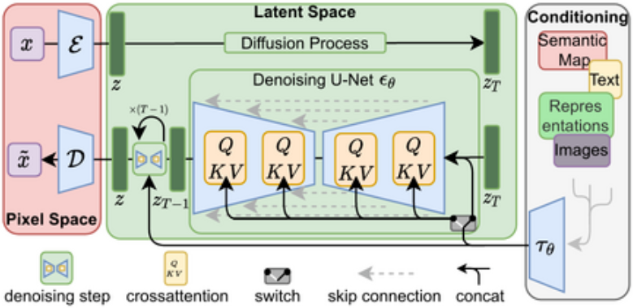
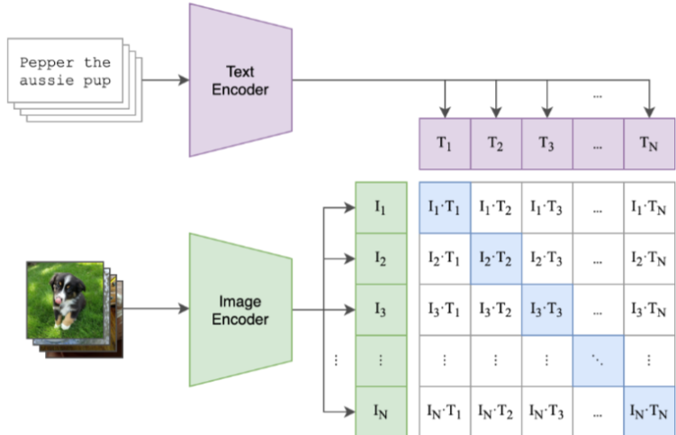
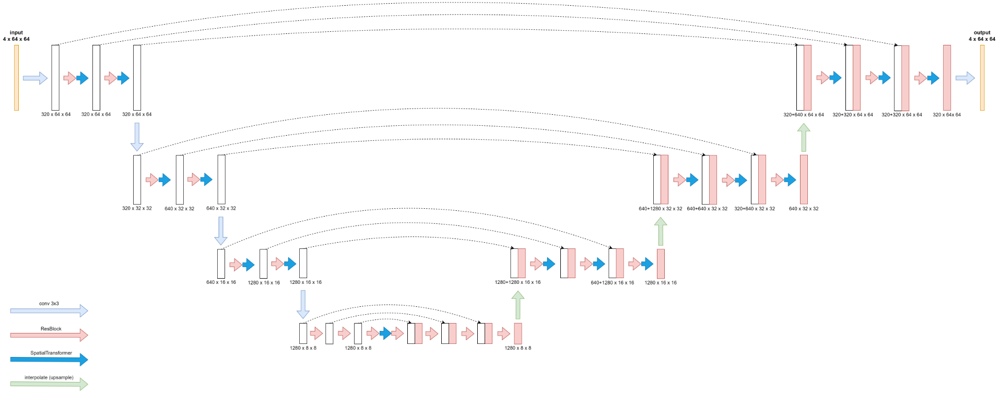
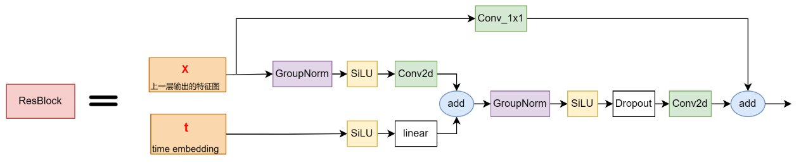
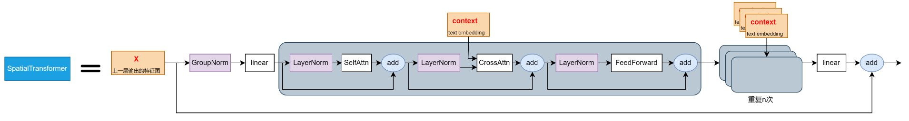

# stable_diffusion

> 参考: https://blog.csdn.net/jarodyv/article/details/131018599

## 一、整体架构



### 1. Autoencoder (自动编码器)
> 左侧红色部分 --采用预训练好的模型

- 将图像数据压缩成低维表示
    1. 编码器E, 将图像编码为低维潜在数据
    2. 解码器D, 将潜在数据解码回图像


### 2. Text Encoder (条件机制)
> 右侧灰色部分 --采用预训练好的模型

- 将文本编码为向量，这里使用的是`CLIP`的Text Encoder
- CLIP的训练流程如下:

    
    1. image特征提取，使用resnet系列或者VIT系列
    2. text特征提取，使用transformer的decoder
    3. 两个特征计算余弦，同一pair对-->1，不同pair对-->0

### 3. 去噪UNet (逆向扩散过程)
> 核心训练部分

#### 3.1 整体网络架构



#### 3.2 ResBlock --融入时间信息



#### 3.3 SpatialTransformer --融入文本信息



## 二、训练步骤
> 参考代码: https://github.com/Stability-AI/stablediffusion/blob/main/ldm/models/diffusion/ddpm.LatentDiffusion.p_losses

```python
def p_losses(self, x_start, cond, t, noise=None):
    # 1. 随机生成noise
    noise = default(noise, lambda: torch.randn_like(x_start))
    # 2. 向图像中添加噪声
    x_noisy = self.q_sample(x_start=x_start, t=t, noise=noise)
    # 3. Unet预测noise
    model_output = self.apply_model(x_noisy, t, cond)

    # 4. 预测的noise与真实noise, 计算loss
    loss_simple = self.get_loss(model_output, target, mean=False).mean([1, 2, 3])
```