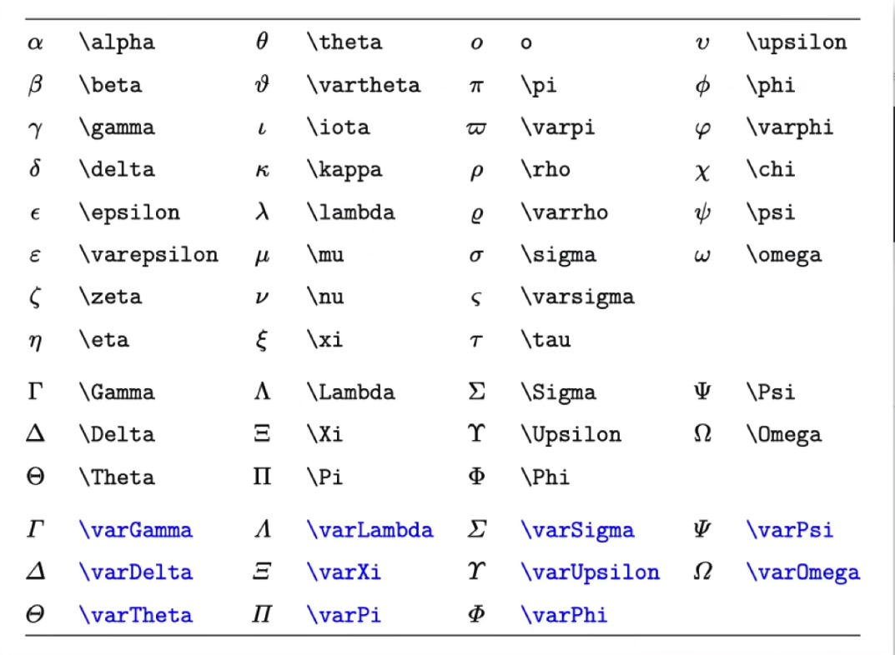

# markdown学习笔记

## 一、标题
##### 五级标题
###### 六级标题

## 二、区块
> 区块示例
>> 子区块1
>>> test

## 三、分割线
---
***
___

## 四、有序列表
1. 有序列表1
    1. 有序列表1.1
2. 有序列表2
3. 有序列表3

## 五、无序列表
- 无序列表1
    - 无序列表1.1
* 无序列表1
+ 无序列表1

## 六、超链接
[我的超链接](https://wap.sogou.com/)

## 七、图片


## 八、代码块
单行代码 `sh docsify.sh`

多行代码
```
    echo 'start docsify'
    nohup docsify serve 1>docsify.std 2>docsify.err &
```

## 九、表格
|表头|表头|表头|
|---|---|---|
|单元格|单元格|单元格|
|单元格|单元格|单元格|
|单元格|单元格|单元格|
|单元格|单元格|单元格|
|单元格|单元格|单元格|

## 十、数学公式(mathjax)
单行: $ 公式 $  
多行:  
$$
公式
$$  
[推荐教程](https://www.bilibili.com/video/av377375258?spm_id_from=444.41.0.0)

## 十一、参考文档
[markdown教程](https://www.runoob.com/markdown/md-tutorial.html)