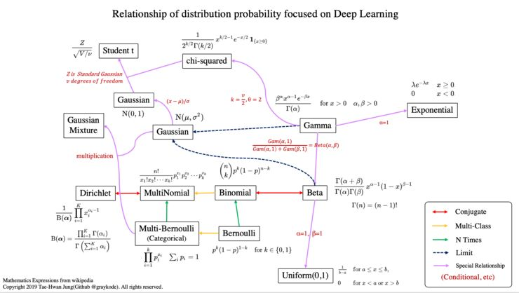

# 常见概率分布
python实现，参考Git: https://github.com/graykode/distribution-is-all-you-need

# 一、 离散分布
## 1. 均匀分布(uniform)

## 2. 伯努利分布(bernoulli)
> 抛1次硬币，正面朝上的概率

$$
P(X=x;\theta) = \theta^x{(1-\theta)}^{1-x}\\
x \in \{0, 1\}
$$
或者:
$$
P(X = x;\theta) =
\begin{cases}
1-\theta,&x=0\\
\theta, &x=1
\end{cases}
$$

## 3. 二项分布(binormial)
> 抛n次硬币，正面朝上出现了k次的概率

$$
P(X = k;n,p) = C_n^kp^k{(1-p)}^{n-k}\\
k \in \{0,1,2,...,n\}
$$

## 4. 多类别分布(categorical)
> 抛1次骰子，第k面朝上的概率
> 相比bernoulli，X的取值可能有K个

$$
P(X=x_k;\theta_1,\theta_2,...,\theta_K) = \prod\limits_{k=1}^K\theta_k^{x_k}\\
\sum\limits_{k=1}^K \theta_k = 1\\
x_k \in \{0, 1\}, \sum\limits_{k=1}^K x_k = 1
$$
例如:
$$
P(X = x;\theta_1,\theta_2,\theta_3) = 
\begin{cases}
{\theta_1 = 0.1}, &x_1=0\\
{\theta_2 = 0.6}, &x_2=1\\
{\theta_3 = 0.3}, &x_3=2
\end{cases}
$$

## 5. 多项式分布(multinomial)
> 抛n次骰子，第1面朝上$m_1$次，第2面朝上$m_2$次，第3面朝上$m_3$次...

$$
\begin{aligned}
P(X_1=m_1,X_2=m_2,...,X_K=m_K;\theta_1,\theta_2,...\theta_K,n) &= C_n^{m_1}C_{n-m_1}^{m_2}...C_{n-m_1-m_2-...-m_{k-1}(=m_k)}^{m_k}\prod\limits_{k=1}^K \theta_k^{m_k}\\
&= \frac {n!} {m_1!m_2!...m_K!} \prod\limits_{k=1}^K \theta_k^{m_k}
\end{aligned}\\
\sum\limits_{k=1}^K \theta_k = 1\\
\sum\limits_{k=1}^K m_k = n
$$

## 6. 泊松分布(Poisson)
$$
P(X = k;\lambda) = \frac {\lambda^k}{k!}e^{-\lambda}\\
k \in \{0,1,2,...,n\}
$$

# 二、 连续分布
## 1. 高斯分布(gaussian)、正态分布(normal)
$$
P(X=x;\mu,\sigma) = \frac 1 {\sqrt{2\pi} \sigma} e^{-\frac {{(x-\mu)}^2} {2\sigma^2}}
$$

> 标准正态分布，$\mu=0, \sigma=1$

## 2. $\gamma$分布(gamma)

## 3. 指数分布(exponential)
- $\gamma$分布的特例
$$
P(X=x;\lambda) = \lambda e^{-\lambda x}, x>0
$$

# 三、其他
## 1. $\beta$分布(beta)

## 2. Dirichlet分布(Dirichlet)

## 3. 卡方分布(chi-squared)
- $\gamma$分布的特例

## 4. $\tau$分布(student-t)

# 题外话: 指数分布族
$$
\begin{aligned}
    P(y;\eta) & = b(y) e^{\eta^T \cdot T(y) - a(\eta)}\\
    & = \frac {b(y) e^{\eta^T \cdot T(y)}} {e^{a(\eta)}}
\end{aligned}
$$

> - y:  data
> - $\eta$: 向量，natural parameter
> - T(y): 向量，a sufficient statistic
>   - 机器学习中涉及到的T(y)，简单认为是y即可
> - b(y): 标量，base measure
> - $a(\eta)$: 标量，log-partion function (对数分割函数)
>   - $a(\eta)$可以看作是整个分布的 归一化常数

- 对于任意的$T(y)、b(y)、a(\eta)$，只要满足$\int_{-\infty}^{+\infty} P(y;\eta) \, \text d y= 1$，就是指数分布族的一员
## 示例:
1. 伯努利分布(bernoulli)

$$
\begin{aligned}
    P(y;\theta) & = \theta^y{(1-\theta)}^{1-y}\\
    & = exp\,\,\, \{log [\theta^y{(1-\theta)}^{1-y}] \}\\
    & = exp\,\,\, \{log [\theta^y] + log[{(1-\theta)}^{1-y}] \}\\
    & = exp\,\,\, \{y log (\theta) + (1-y)log(1-\theta) \}\\
    & = exp\,\,\, \{y log (\theta) - ylog(1-\theta) + log(1-\theta) \}\\
    & = exp\,\,\, \{y log \frac \theta {1-\theta} + log(1-\theta) \}
\end{aligned}
$$

> 对比公式$P(y;\eta) = b(y) e^{\eta^T \cdot T(y) - a(\eta)}$，可得:
> - b(y) = 1
> - $\eta = log \frac \theta {1-\theta} \Rightarrow e^{\eta} = \frac \theta {1-\theta} \Rightarrow \theta = \frac 1 {1+e^{-\eta}}$
> - T(y) = y
> - $a(\eta) = - log(1-\theta) = log(1+e^{\eta})$

2. 泊松分布
3. 高斯分布(gaussian)

$$
\begin{aligned}
    P(y;\mu,\sigma) & = \frac 1 {\sqrt{2\pi} \sigma} e^{-\frac {{(y-\mu)}^2} {2\sigma^2}}\\
    & = \frac 1 {\sqrt{2\pi} \sigma} e^{\frac {-y^2 + 2 \mu y - \mu^2} {2\sigma^2}}\\
    & = \frac 1 {\sqrt{2\pi}} e^{log{\frac 1 \sigma}} e^{\frac {-y^2 + 2 \mu y - \mu^2} {2\sigma^2}}\\
    & = \frac 1 {\sqrt{2\pi}} e^{\frac {-y^2 + 2 \mu y} {2\sigma^2}  - \frac {\mu^2} {2 \sigma^2} + log{\frac 1 \sigma}}\\
    & = \frac 1 {\sqrt{2\pi}}
        e^{
            (-\frac 1 {2\sigma^2}, \frac {2\mu} {2\sigma^2})
            \begin{pmatrix}
                y^2\\
                y
            \end{pmatrix}
            - (\frac {\mu^2} {2 \sigma^2} - log{\frac 1 \sigma})
        }
\end{aligned}
$$

> 对比公式$P(y;\eta) = b(y) e^{\eta^T \cdot T(y) - a(\eta)}$，可得:
> - $b(y) = \frac 1 {\sqrt{2\pi}}$
> - $\eta = {(-\frac 1 {2\sigma^2}, \frac {2\mu} {2\sigma^2})}^T $
> - $T(y) = {(y^2, y)}^T$
> - $a(\eta) = \frac {\mu^2} {2 \sigma^2} - log{\frac 1 \sigma}$

4. $\gamma$分布

5. 指数分布

6. $\beta$分布

7. Dirichlet分布

## 性质
1. 最大似然估计，是个凸优化问题
2. $E[y; \eta] = \frac {\partial a(\eta)} {\partial \eta}$
3. $Var[y; \eta] = \frac {\partial^2 a(\eta)} {\partial \eta^2}$