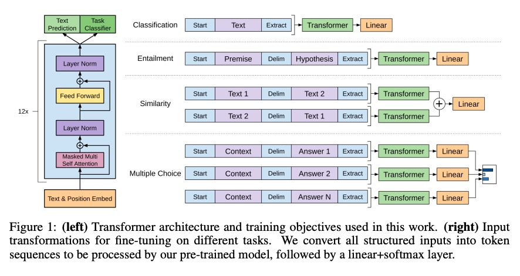
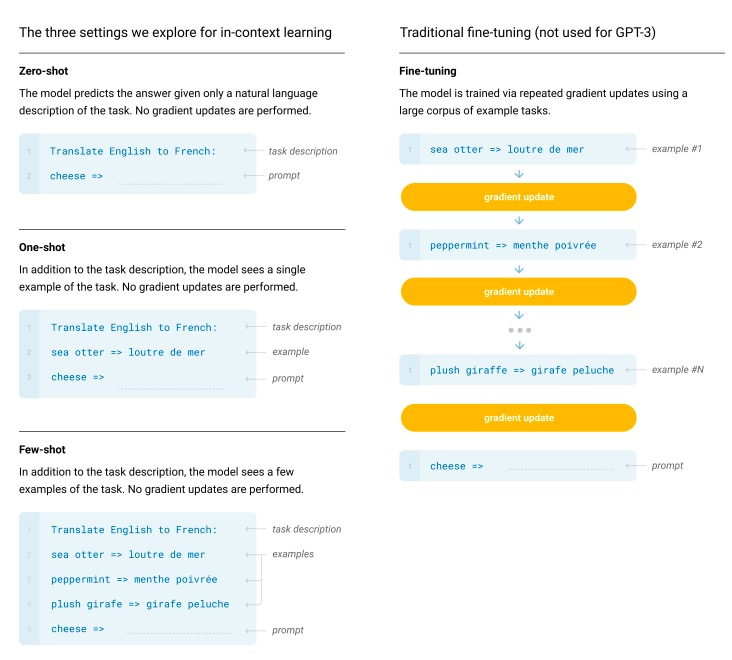

# GPT系列

## GPT-1
### 1. 模型结构
- **transformer**的`decoder`

### 2. 预训练任务
标准的语言模型，给定一个文本序列，根据前边 $i-1$ 个词，来预测第 $i$ 个词

### 3. 下游任务上的fine-tuning
- 在这之前的**word2vec**、**ELMo**，采用的feature-based的预训练模式
    > 先在一个大规模预料上去预训练，得到word_embdding这种特征  
    > 然后针对具体的下游任务，直接使用训练好的特征，构建各自的模型去训练
- **GPT**首次提出这种fine-tuning模式
    > 针对具体的下游任务，只需要修改`input的形式`，就可以套用预训练所使用的模型
- 具体修改方式可以参照论文中这张图片:

     

### 4. zero-shot
> - paper: https://arxiv.org/abs/1710.04837  
> - 知乎介绍文章: https://zhuanlan.zhihu.com/p/34656727

论文中还做了实验，只使用预训练模型，不经过**fine-tuning**，直接去下游任务上评估效果  
发现随着预训练过程中模型的不断更新，下游任务上的表现也越好

## GPT-2
- 在GPT的基础上，做了几处修改:
    1. 进一步增加预训练数据数量
        - **Bert**增加了`Wikipedia`，**GPT-2**整理出了`WebText`
    2. 加深transformer层次，参数规模比**GPT-1**大了一个数量级
    3. subword算法
        - BPE ---> BBPE
    4. 只使用**zero-shot**
        - 不再进行下游任务的**fine-tuning**，预训练的模型直接去下游任务上评估效果

## GPT-3
- 进一步增加训练集，扩大模型规模
- 对之前的**zero-shot**进一步探索，提出一个新名词 `in-context learning`，包括3种方式:
    1. zero-shot
    2. one-shot
    3. few-shot

    > 预训练好语言模型之后，在做推理时，只需要将`input`修改为特定格式，经过模型，得到`output`
    
- 具体做法可以参照论文中这张图片:  
     

## 题外话
**ELMo** --> **GPT-1** --> **Bert** --> **GPT-2** --> **RoBERTa** --> **GPT-3**

|模型|数据集|词量|subword|模型|参数量|备注|
|---|---|---|---|---|---|---|
|$ELMo$|1B Word Benchmark|10亿|||90M||
|$GPT$|BooksCorpus|8亿|BPE|L=12,H=768,A=12|110M|`Word Benchmark`中句子顺序随机打乱，无法建模句子之间的依赖关系，弃用|
|$BERT_{base}$|16G BooksCorpus + Wikipedia|8亿 + 25亿|wordpiece|L=12,H=768,A=12|110M|为了跟`GPT-1`做对比|
|$BERT_{large}$|同上|同上|wordpiece|L=24,H=1024,A=16|340M||
|GPT-2|40G WebText   1. 过滤低质量文本  2. 除去Wikipedia中的数据||BBPE|L=12,H=768|117M|为了跟`GPT-1`做对比|
|GPT-2|同上||BBPE|L=24,H=1024|345M|为了跟`Bert`做对比|
|$GPT-2$|同上||BBPE|L=48,H=1600|1542M||
|$RoBERTa$|16G BooksCorpus + Wikipedia   76G CC-News   38G OpenWebText   31G Stories||BBPE||||
|$GPT-3$|Common Crawl   WebText2   Books1   Books2   Wikipedia|||L=96,H=12288,A=96|175B||

