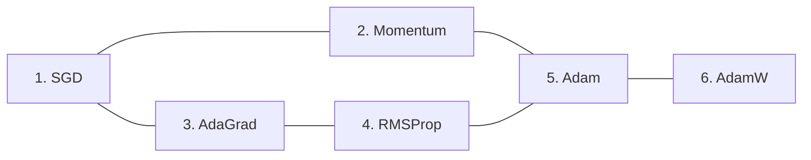

# 优化算法

## 概览:


## 1. SGD
- 梯度下降
- 随机梯度下降
- 批梯度下降 `通常使用这种`
$$
    \bm{\theta}_t = \bm{\theta}_{t-1} - \eta_t \bm{g}_t
$$
> 这里的$\eta_t$可以随着时间，自我衰减，详见[学习率调整](神经网络基础/学习率退火.md)

<details>
<summary><b>代码实现</b></summary>

```python
while True:
    dx = compute_gradient(x)
    x -= learning_rate * dx
```

</details>


<details>
<summary><b>调用pytorch接口</b></summary>

```python
import torch.optim as optim

optimizer = optim.SGD(net.parameters(), lr=0.03) # 学习率0.03
```

</details>

## 2. Momentum
#### 引入一个新的变量 $\bm{v}_t$，初始化 $\bm{v}_0=0$
$$
    \bm{v}_t = \gamma \bm{v}_{t-1} + \eta_t \bm{g}_t \\
    \bm{\theta}_t = \bm{\theta}_{t-1} - \bm{v}_t
$$
> 其中 $0 \le \gamma < 1$  
- 这里的 $\bm{v}_t$，相当于最近$\frac 1 {1-\gamma}$个时间步的$\bm{g}_t$的加权和  
    > 例如$\gamma=0.5$，$\bm{v}_t$相当于最近2个时间步的`小批量梯度`的加权和  
    > 例如$\gamma=0.9$，$\bm{v}_t$相当于最近10个时间步的`小批量梯度`的加权和

<details>
<summary><b>代码实现</b></summary>

- 实现方式在原始公式上做了一些修改:
$$
    \bm{v}_t = \mu \bm{v}_{t-1} + \bm{g}_t \\
    \bm{\theta}_t = \bm{\theta}_{t-1} - \eta_t \bm{v}_t
$$

```python
v = 0
while True:
    dx = compute_gradient(x)
    v = mu * v + dx
    x -= learning_rate * v
```

</details>


<details>
<summary><b>调用pytorch接口</b></summary>

```python
import torch.optim as optim

# 相比SGD，只需要多指定一个 参数momentum:
optimizer = optim.SGD(net.parameters(), lr=0.03, momentum=0.9) # 学习率0.03, gamma=0.9
```

</details>


## 3. AdaGrad(Adaptive Gradient)
> 在之前的算法中，$\vec{\theta} = (\theta_1,\theta_2,\cdots)$中的每个$\theta_i$按照同一个学习率$\eta$来更新  
> **AdaGrad**根据每个维度梯度值的大小，来调整每个维度的学习率

#### 引入一个新的变量 $\bm{s}_t$，初始化 $\bm{s}_0=0$
$$
    \bm{s}_t = \bm{s}_{t-1} + \bm{g}_t \odot \bm{g}_t
$$
> $\odot$表示逐元素乘积， $\bm{s}_t$ 保存了以前所有梯度值的平方和

#### 然后更新参数:  
$$
    \bm{\theta}_t = \bm{\theta}_{t-1} - \eta \frac 1 {\sqrt{\bm{s}_t} + \epsilon} \odot \bm{g}_t
$$
> $\epsilon$ 是为了维持数值稳定性而添加的常数，如$10^{-6}$  
> 更新参数时，根据 $\bm{s}_t$ 调整学习尺度。意味着变动较大的参数，学习率逐渐变小

<details>
<summary><b>代码实现</b></summary>

```python
grad_squared = 0
while True:
    dx = compute_gradient(x)
    grad_squared += dx * dx
    x -= learning_rate * dx / (np.sqrt(grad_squared) + 1e-8)
```

</details>


<details>
<summary><b>调用pytorch接口</b></summary>

```python
import torch.optim as optim

optimizer = optim.Adagrad(net.parameters(), lr=0.1) # 学习率0.1
```

</details>


## 4. RMSProp
> AdaGrad会记录过去所有梯度的平方和，$\bm{s}_t$一直在累加。学习越深入，更新幅度越小  
#### RMSProp做了进一步修改，会逐渐遗忘过去的梯度，更多地关注 较新的梯度：

$$
    \bm{s}_t = \gamma \bm{s}_{t-1} + (1-\gamma) \bm{g}_t \odot \bm{g}_t
$$
> 类似于**Momentum**，$\bm{s}_t$相当于最近$\frac 1 {1-\gamma}$个时间步的 $\bm{g}_t \odot \bm{g}_t$ 的加权平均  
> $\gamma$ 常用值是 [0.9, 0.99, 0.999]

#### 然后再按照这样的方式去更新参数:  
$$
    \bm{\theta}_t = \bm{\theta}_{t-1} - \eta \frac 1 {\sqrt{\bm{s}_t} + \epsilon} \odot \bm{g}_t
$$

<details>
<summary><b>代码实现</b></summary>

```python
grad_squared = 0
while True:
    dx = compute_gradient(x)
    grad_squared += decay_rate * grad_squared + (1-decay_rate) * dx * dx
    x -= learning_rate * dx / (np.sqrt(grad_squared) + 1e-8)
```

</details>


<details>
<summary><b>调用pytorch接口</b></summary>

```python
import torch.optim as optim

# 相比AdaGrad，多指定一个参数alpha
optimizer = optim.RMSprop(net.parameters(), lr=0.1, alpha=0.9) # 学习率0.1, gamma=0.9
```

</details>


## 5. Adam
> Momentum 与 RMSProp的结合

#### 首先，类似Momentum中那样更新 $\bm{v}_t$
$$
    \bm{v}_t = \beta_1 \bm{v}_{t-1} + (1-\beta_1) \bm{g}_t 
$$

#### 然后，类似RMSProp中那样更新 $\bm{s}_t$
$$
    \bm{s}_t = \beta_2 \bm{s}_{t-1} + (1-\beta_2) \bm{g}_t \odot \bm{g}_t
$$

> 这里有个问题就是t较小时，相应的$\bm{v}_t、\bm{s}_t$也比较小  
> 例如，取$\beta_1=0.9$时，$\bm{v}_1 = 0.9 * \bm{v}_0 + 0.1 * \bm{g}_1 = 0.1 \bm{g}_1$  
> 于是，Adam中对$\bm{v}_t、\bm{s}_t$做了进一步修正
$$
    \hat{\bm{v}}_t = \frac {\bm{v}_t} {1-(\beta_1)^t} \\
    \hat{\bm{s}}_t = \frac {\bm{s}_t} {1-(\beta_2)^t} \\
$$

#### 最后，更新参数
$$
    \bm{\theta}_t = \bm{\theta}_{t-1} - \eta \frac 1 {\sqrt{\hat{\bm{s}}_t} + \epsilon} \odot \hat{\bm{v}}_t
$$

> 论文中推荐的参数值 $ \epsilon=1e-8, \beta_1=0.9, \beta_2=0.999 $


<details>
<summary><b>代码实现</b></summary>

```python
first_moment = 0
second_moment = 0
for t in range(num_iter):
    dx = compute_gradient(x)

    # 类似Momentum中那样更新 v_t
    first_moment = beta1 * first_moment + (1-beta1) * dx

    # 类似RMSProp中那样更新 s_t
    second_moment = beta2 * second_moment + (1-beta2) * dx * dx

    # 对v_t、s_t做进一步修正
    first_unbias = first_moment / (1 - beta1 ** t)
    second_unbias = second_moment / (1 - beta2 ** t)

    # 参数更新
    x -= learning_rate * first_unbias / (np.sqrt(second_unbias) + 1e-8)
```

</details>


<details>
<summary><b>调用pytorch接口</b></summary>

```python
import torch.optim as optim

optimizer = optim.Adam(net.parameters(), lr=0.1, betas=(0.9, 0.999)) # 学习率0.1
```

</details>


## 6. AdamW
- Adamw 即 Adam + weight decay，效果与 Adam + L2正则化相同，但是计算效率更高
- 参考链接: https://www.cnblogs.com/tfknight/p/13425532.html


<details>
<summary><b>调用pytorch接口</b></summary>

```python
import torch.optim as optim

# 参数与Adam完全相同
optimizer = optim.AdamW(net.parameters(), lr=0.1, betas=(0.9, 0.999)) # 学习率0.1
```

</details>


## 其它
### 1. 二阶方法: 牛顿法
- 实例: 最大熵模型、CRF
$$
    \bm{\theta}_t = \bm{\theta}_{t-1} - \eta_t \bm{g}_t \\
    这里的\eta_t \bm{g}_t 部分，只使用了一阶导 \\
    引入Hessian矩阵，考虑使用二阶导 \\
    \bm{\theta}_t = \bm{\theta}_{t-1} -  {H_t}^{-1} \bm{g}_t \\
$$

### 2. 坐标下降法
- 实例: SVM中的SMO算法