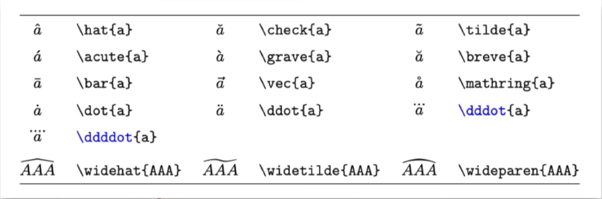
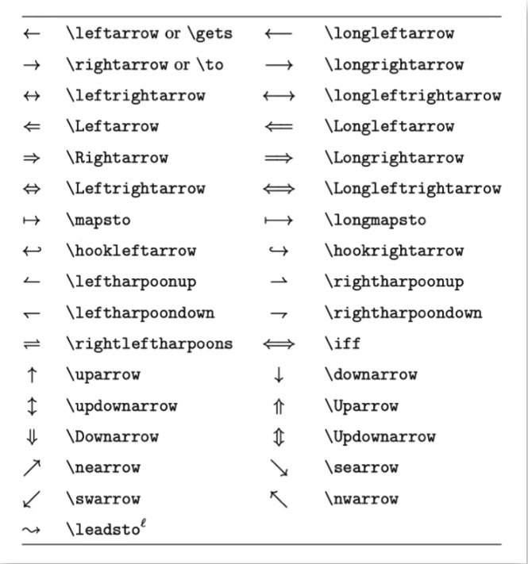

# Latex学习笔记
## 一、希腊字母
$$
\delta,\lambda\\
\Delta, \Lambda\\
\alpha, \beta\\
\phi, \varphi, \Phi\\
\epsilon, \varepsilon, \Epsilon
$$
  
也可参考这里: https://oeis.org/wiki/List_of_LaTeX_mathematical_symbols
## 二、上下标
$$
a^2\\
a_3\\
x^{y+z}\\
x_i, x_{\text i}\\
x, y, \text {x, y}\\
\text {e}
$$

## 三、分式与根式
$$
\frac 1 2\\
\frac {a^2+b} {x^3-y_2}
$$

$$
\sqrt 2\\
\sqrt[5] {a^3-b_2}
$$

## 四、普通运算符
$$
+,-,\pm,\mp\\
\times,\cdot,\div\\
<,>,\ge,\le,\gg,\ll,\ne,\approx,\equiv\\
\cap,\cup,\in,\notin,\subseteq,\varnothing\\
\forall, \exists, \nexists\\
\because, \therefore\\
\mathbb R, \R, \N, \Z, \Z_+, \mathbb Q\\
\mathcal F\\
\infty
$$

$$
\cdots,\vdots,\ddots
$$

$$
\infty, \partial, \nabla, \propto, \degree\\
\sin x, \sec x, \log_2 x\\
\lim_{x \to 0} \frac {x}{\sin x}
有些编辑器需要:
\lim\limits_{x \to 0} \frac {x}{\sin x}
$$

## 五、大型运算符
$$
\sum, \prod\\
\sum_i, \sum_{i=0}^N\\
\int, \iint, \iiint, \oint, \oiint\\
\int_{-\infty}^0 f(x)\,\text d x
$$

## 六、标注符号
$$
\vec x, \overrightarrow{AB}\\
\bar x, \overline{AB}
$$

## 七、箭头
$$
\leftarrow,\rightarrow,\Rightarrow,\Leftrightarrow
$$

## 八、括号与定界符
$$
()[] \{\}\\
\left(0, \frac 1 x \right]\\
\left.\frac {\partial f} {\partial x}\right|_{x=0}
$$

## 九、换行
$$
\begin{aligned}
a&=b+c+d\\
&=x+y
\end{aligned}
$$
## 十、大括号
$$
f(x)=
\begin{cases}
\sin x, &-\pi\le x \le\pi\\
0,&\text{其他}
\end{cases}
$$
## 十一、矩阵
$$
\begin{matrix}
a_{11} & a_{12} & \cdots & a_{1n}\\
\vdots & \vdots & \ddots & \vdots\\
a_{n1} & a_{n2} & \cdots & a_{nn}
\end{matrix}
$$

$$
bracket, []\\
\begin{bmatrix}
a_{11} & a_{12} & \cdots & a_{1n}\\
\vdots & \vdots & \ddots & \vdots\\
a_{n1} & a_{n2} & \cdots & a_{nn}
\end{bmatrix}
$$

$$
parenthesis, ()\\
\begin{pmatrix}
a_{11} & a_{12} & \cdots & a_{1n}\\
\vdots & \vdots & \ddots & \vdots\\
a_{n1} & a_{n2} & \cdots & a_{nn}
\end{pmatrix}
$$

$$
vertical bar, ||\\
\begin{vmatrix}
a_{11} & a_{12} & \cdots & a_{1n}\\
\vdots & \vdots & \ddots & \vdots\\
a_{n1} & a_{n2} & \cdots & a_{nn}
\end{vmatrix}
$$

$$
\mathbf A = 
\mathbf B^{\rm T} = 
\begin{bmatrix}
a_{11} & a_{12} & \cdots & a_{1n}\\
\vdots & \vdots & \ddots & \vdots\\
a_{n1} & a_{n2} & \cdots & a_{nn}
\end{bmatrix}
$$