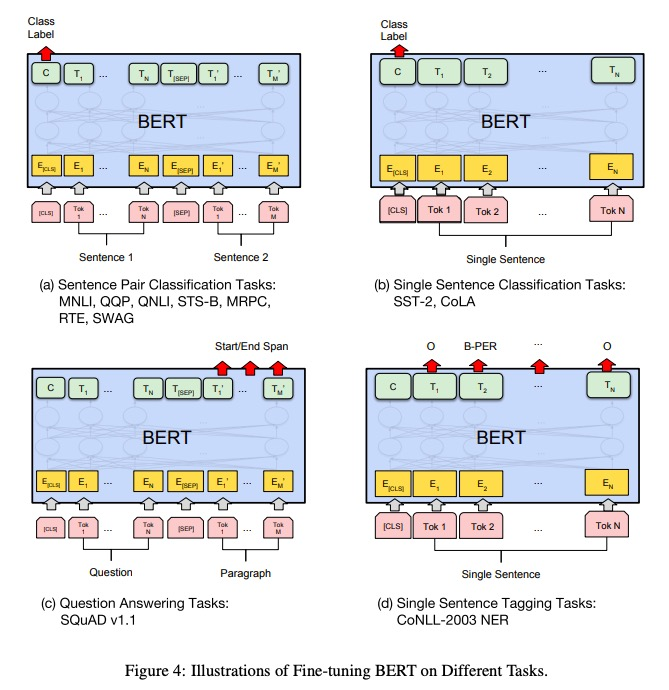

# Bert

## 1. 模型结构
- **transformer**的`encoder`

## 2. 预训练任务
1. 单词级任务
    - MLM，Mask语言模型
2. 句子级任务
    - NSP，下一句预测
3. 输入格式如下:
    - [CLS] my dog is cute [SEP] he likes play ##ing [SEP]
    > 这里`playing`拆分为 `play`和`##ing`

## 3. 下游任务上的fine-tuning
1. SQuAD (Stanford Question Answering dataset)
    - 问答语料, 句子对 <问题, 包含答案的段落>
    - 输入格式: `[CLS] 问题 [SEP] 包含答案的段落`
    - 训练方式: 引入两个向量S、E，对于段落中的每个$token_i$，计算其为答案开始的概率 $\frac {exp(S \cdot T_i)} {\sum_j exp(S \cdot T_j)}$、答案结束的概率 $\frac {exp(E \cdot T_i)} {\sum_j exp(E \cdot T_j)}$
2. SWAG
    - 给出一句话，以及a、b、c、d四个选项(每个选项为一句话)，选择 使得语义最连贯的一句
    - 113K, 句子对 <第一句话，选项a>，<第一句话，选项b>，<第一句话，选项c>...
    - 输入格式: `[CLS] 第一句话 [SEP] 选项`
    - 训练方式: 每句话，4个选项，可得到4个[CLS]，通过softmax计算概率最高的那个
3. 其他可以看看论文中这张图片:

     