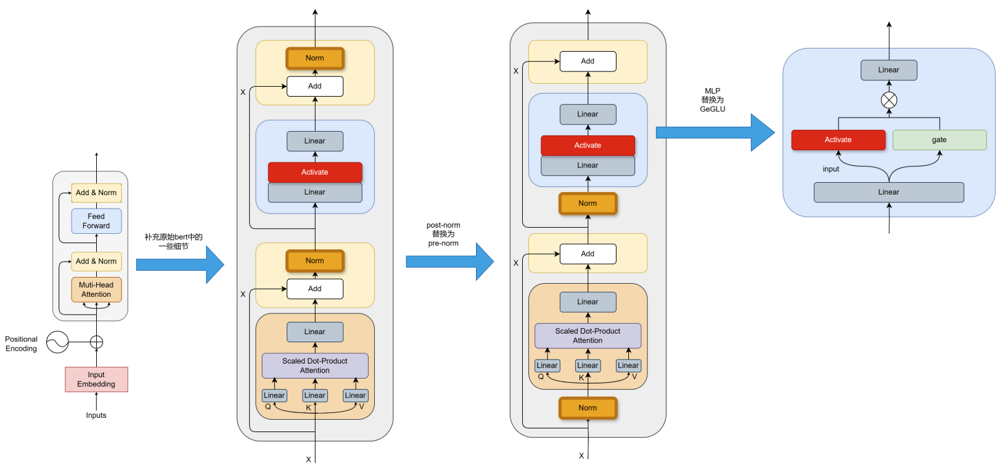
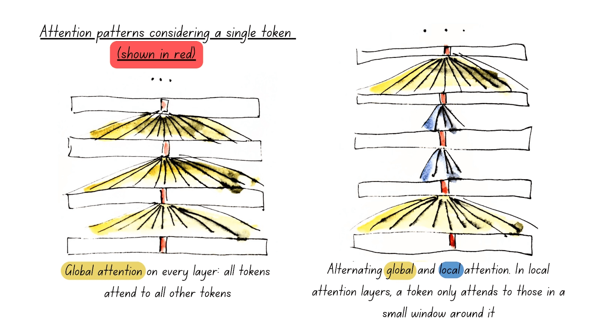
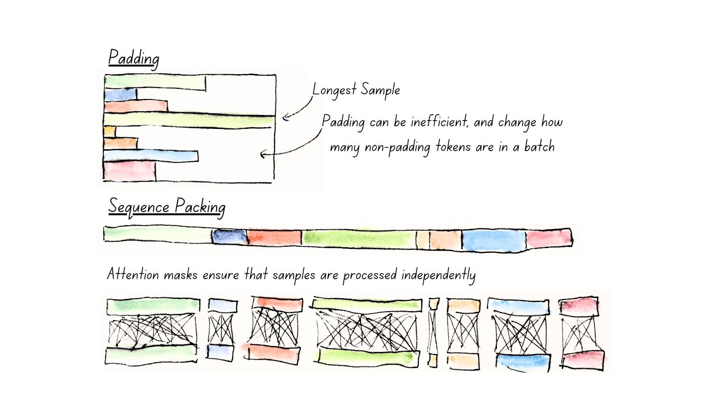

# ModernBERT

> paper: https://arxiv.org/abs/2412.13663  
> git: https://github.com/AnswerDotAI/ModernBERT  
> 博客: https://huggingface.co/blog/modernbert

## 一、transformer架构演进

### 1. 消除偏置项

1. 线性层
    ```python
    # 原始bert中的qkv矩阵
    self.query = nn.Linear(config.hidden_size, self.all_head_size)
    self.key = nn.Linear(config.hidden_size, self.all_head_size)
    self.value = nn.Linear(config.hidden_size, self.all_head_size)

    # ModernBERT中的qkv矩阵
    self.Wqkv = nn.Linear(config.hidden_size, 3 * self.all_head_size, bias=False)
    ```

2. LayerNorm
    ```python
    # 原始bert中的LayerNorm
    self.LayerNorm = nn.LayerNorm(config.hidden_size, eps=config.layer_norm_eps)

    # ModernBERT中的LayerNorm
    self.norm = nn.LayerNorm(config.hidden_size, eps=1e-6, bias=False)
    ```

    <details>
    <summary>ModernBERT中默认使用了RMSNorm，可以看到，参数也只有W矩阵，没有bias</summary>
        
    ```python
    class RMSNorm(nn.Module):
    """Llama2 RMSNorm implementation"""

        def __init__(self, dim: int, eps: float = 1e-6):
            super().__init__()
            self.eps = eps
            self.weight = nn.Parameter(torch.ones(dim))

        def _norm(self, x):
            return x * torch.rsqrt(x.pow(2).mean(-1, keepdim=True) + self.eps)

        def forward(self, x):
            output = self._norm(x.float()).type_as(x)
            return output * self.weight
    ```

    </details>
    

### 2. 旋转位置编码(RoPE)
- bert中使用绝对位置编码，直接在embedding层添加一组参数position_embeddings
    ```python
    class BertEmbeddings(nn.Module):
        """Construct the embeddings from word, position and token_type embeddings."""

        def __init__(self, config):
            super().__init__()
            self.word_embeddings = nn.Embedding(config.vocab_size, config.hidden_size, padding_idx=config.pad_token_id)
            self.position_embeddings = nn.Embedding(config.max_position_embeddings, config.hidden_size)

        def forward(self, input_ids, position_ids) -> torch.Tensor:
            embeddings = self.word_embeddings(input_ids)
            position_embeddings = self.position_embeddings(position_ids)
            embeddings += position_embeddings
            return embeddings
    ```
- ModernBERT使用相对位置编码，embedding层不需要`position_embeddings`，而是在计算注意力时，再利用token间的相对位置，来计算注意力
    ```python
    class FlexBertUnpadRopeAttention(FlexBertAttentionBase):
        def forward(self):
            # 1. 计算q、k、v
            qkv = self.Wqkv(hidden_states)
            # 2. 拆分q、k、v
            qkv = qkv.view(-1, 3, self.num_attention_heads, self.attn_head_size)
            # 3. 计算token间的相对位置，来引入位置信息
            qkv = self.rotary_emb(qkv, cu_seqlens=cu_seqlens, max_seqlen=max_seqlen, seqlen_offset=seqlen_offset)
            # 4. 计算注意力
            ...
    ```

### 3. 规范化
```python
# 原始bert使用post-norm
attn_out = self.attn_norm(hidden_states + self.attn(hidden_states, cu_seqlens, max_seqlen, indices, attn_mask))
mlp_out = self.mlp_norm(attn_out + self.mlp(attn_out))

# ModernBERT使用pre-norm
attn_out = hidden_states + self.attn(self.attn_norm(hidden_states), cu_seqlens, max_seqlen, indices, attn_mask)
mlp_out = attn_out + self.mlp(self.mlp_norm(attn_out))
```

### 4. MLP-->GeGLU
```python
# MLP
return self.Wo(self.drop(self.act(self.Wi(hidden_states))))

# GeGLU
input, gate = self.Wi(hidden_states).chunk(2, dim=-1)
return self.Wo(self.drop(self.act(input) * gate))
```

### 概览


## 二、计算效率提升

### 1. 全局注意力、局部注意力 交替

- 通过`Flash Attention 2`来实现
    ```python
    from flash_attn import flash_attn_varlen_qkvpacked_func

    # 全局注意力，window_size=(-1,-1)
    # 局部注意力，例如窗口为128时，window_size=(64,64)
    attn = flash_attn_varlen_qkvpacked_func(
        qkv,
        cu_seqlens=cu_seqlens,
        max_seqlen=max_seqlen,
        dropout_p=self.p_dropout,
        deterministic=self.deterministic_fa2,
        window_size=self.sliding_window,
    )
    ```
- 示意图
    

### 2. 去填充、序列打包
- 通过`Flash Attention 2`来实现
    ```python
    from flash_attn import flash_attn_varlen_qkvpacked_func

    # 例如原始的batch=[[2,5,7], [1,4,9,3,6]]
    # 拼接后的sequence为[2,5,7,  1,4,9,3,6]
    attn = flash_attn_varlen_qkvpacked_func(
        qkv,
        cu_seqlens=cu_seqlens, # 这里传入[0,3,8], 用于索引qkv
        max_seqlen=max_seqlen, # 批次中序列的最大长度, 这里为5
        dropout_p=self.p_dropout,
        deterministic=self.deterministic_fa2,
        window_size=self.sliding_window,
    )
    ```
- 示意图
    

## 三、硬件感知的模型设计
- todo

## 四、训练
1. 训练数据、tokenizer
    |模型|数据集|token量|词表大小|
    |---|---|---|---|
    |bert|16G BooksCorpus + Wikipedia|8亿 + 25亿|21128|
    |ModernBERT|网络文档 + 程序代码 + 学术论文|2w亿|50368|
2. 训练任务
    - MLM, mask的概率为30%
3. 优化器
    - 论文中介绍使用的`StableAdamW`，但是代码中默认使用的`DecoupledAdamW`
4. 训练阶段
    |阶段|token量|学习率(base版)|序列长度|
    |---|---|---|---|
    |第一阶段|17000亿|Warmup(30亿)-Stable <br>8e-4|1k|
    |第二阶段|2500亿|Warmup-Stable <br>3e-4|8k|
    |第三阶段|500亿|Warmup-Stable-Decay|不同长度混合|
