# T5 (Text-to-Text Transfer Transformer)

## 1. 输入输出
1. **GPT**适合生成类任务，例如`问答`、`摘要`
    - 输入输出均为 字符串
2. **Bert**适合理解类任务，例如:
    - `文本分类`，输入: 字符串，输出: 相应label
    - `句子关系判断`，输入: 字符串，输出: 相应label
3. **T5**将形式统一起来，针对所有任务，输入输出均改为 字符串
    - 这个图中一目了然:  
        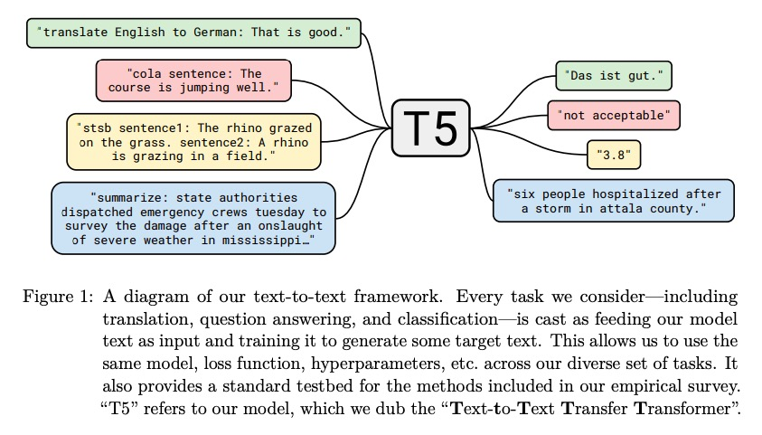 

## 2. baseline
1. model
    - **GPT** 使用 decoder
    - **Bert** 使用 encoder
    - **T5**的baseline 使用 encoder-decoder
2. 预训练的目标函数
    - 输入为下图中的`inputs`，输出为`targets`:  

        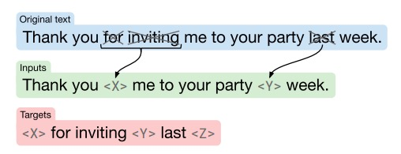 
        
3. fine-tuning
    - 在每个任务上单独fine-tuning，都会迭代$2^{18}$个step
    - 每隔5000个step保存一个checkpoint，选取性能最好的checkpoint

## 3. 大量实验
> 每次控制一个变量，找到性能最好的参数

### 1. 体系结构
    
1. 模型
    - 尝试了3种`encoder-decoder`、`decoder`(标准的language model)、`prefix language model`
2. 目标函数
    - 尝试了两种`language model`、baseline中的`denoising objective`
3. 实验结果如图:

    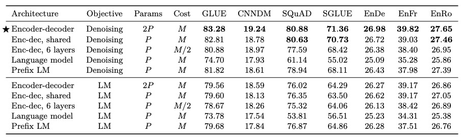 

4. 结论:
    - 模型采用`encoder-decoder`
    - 目标函数采用baseline中的`denoising objective`

### 2. 预训练阶段的目标函数
1. 几种目标函数的说明:

    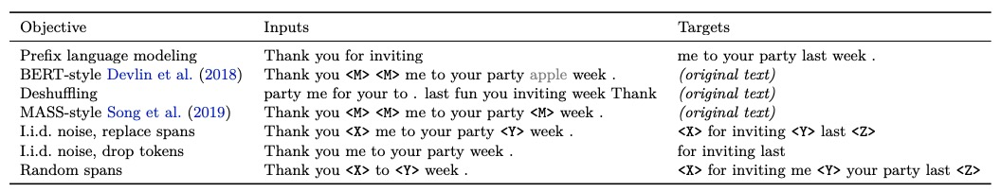 

2. 接下来一步步尝试:
    1. 先比较这三种:

        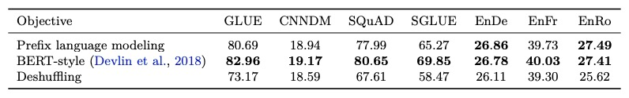 

    2. 然后尝试`BERT-style`的几种变体

        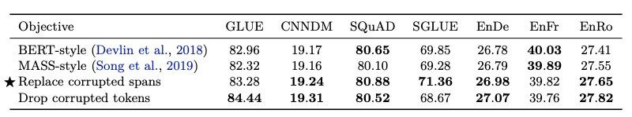 

        > 分别对应上面说明中的2、4、5、6行
    3. 对于上面的`replace corrupted spans`，尝试不同的mask比率

        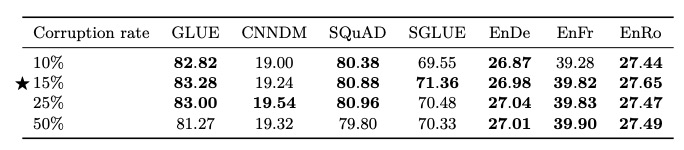 

    4. 15%的mask比率下，尝试不同长度的`span mask`

        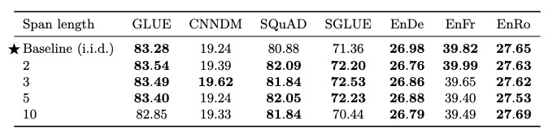 

        > 对应上面说明中的7行
3. 上面4步可以用这个来概括:  

    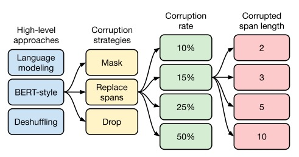 

4. 结论:
    - `BERT-style`要优于`prefix language model`、`deshuffling`
    - `BERT-style`的各种变体无明显差异，但是不同长度的`span mask`会影响序列长度，从而影响训练速度

### 3. 下游任务上的训练策略
1. 微调(fine-tuning)
    - 尝试两种更新部分参数的方法`Adaper layers`、`Gradual unfreezing`

    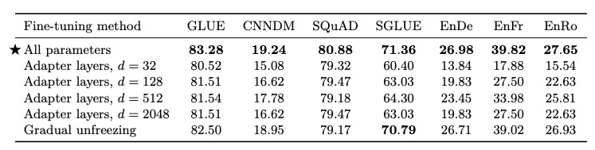 

    - 结论: 论文中认为`Adaper layers`有希望
2. 多任务学习(multi-task learning)
    - 这里的做法是 **忽略之前的预训练**，直接把所有数据集混合在一起去训练
    - 研究了两种混合策略，来看看多任务学习的效果  

    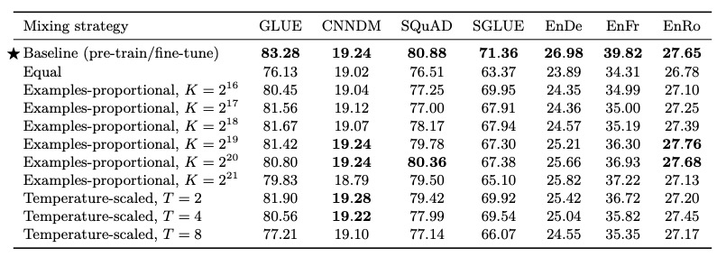 

    - 结论: 直接进行多任务学习，要弱于baseline
3. ( pre-training + fine-tuning ---> ) multi-task + fine-tuning

    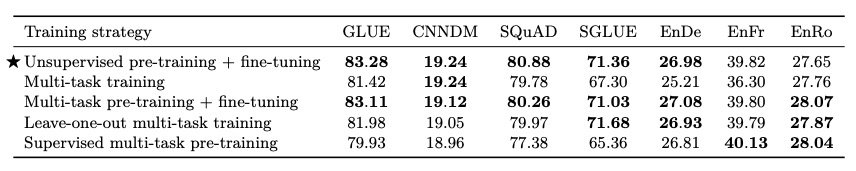 

    > 第一行，baseline  
    > 第二行，是上一节的只进行多任务学习，examples-proportional，$K=2^{19}$   
    > 第三行，多任务学习 + 微调  
    > 第四行，多任务学习时，过滤掉特定的任务 + 特定任务上的微调  
    > 第五行，只在所有监督数据上进行多任务学习 + 微调

### 4. 扩大规模
- 尝试了几种方法，增加训练步数、增加batch_size、集成等等
- 意料之中，都可以提高性能

## 结论
1. 预训练的目标函数，推荐 长度为3的`span mask`
2. 增加训练步数可以提高性能
3. 增加模型参数可以提高性能，提供了5种规模的模型
4. `multi-task + fine-tuning` 可以达到与 `pre-training + fine-tuning` 相近的性能

