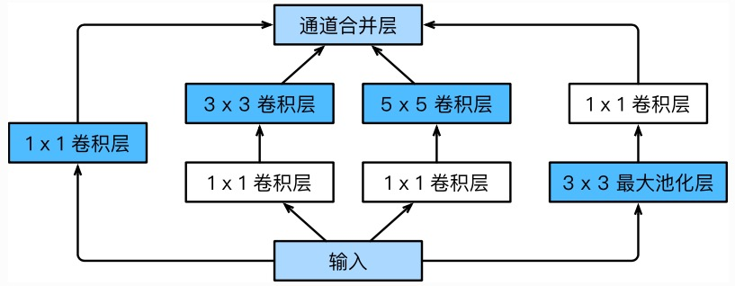

# GoogLeNet

## 一、Inception块

- 示意图
    
    

- 代码实现
    ```python
    class Inception(nn.Module):
        # c1-c4 为每条线路里的层的输出通道数
        def __init__(self, in_c, c1, c2, c3, c4):
            super(Inception, self).__init__()
            # 线路1: 1x1卷积层
            self.p1_1 = nn.Conv2d(in_c, c1, kernel_size=1)                 # (bs, in_c, h, w)-->(bs, c1, h, w)
            # 线路2: 1x1卷积层、 3x3卷积层
            self.p2_1 = nn.Conv2d(in_c, c2[0], kernel_size=1)              # (bs, in_c, h, w)-->(bs, c2[0], h, w)
            self.p2_2 = nn.Conv2d(c2[0], c2[1], kernel_size=3, padding=1)  # (bs, c2[0], h, w)-->(bs, c2[1], h, w)
            # 线路3: 1x1卷积层、 5x5卷积层
            self.p3_1 = nn.Conv2d(in_c, c3[0], kernel_size=1)              # (bs, in_c, h, w)-->(bs, c3[0], h, w)
            self.p3_2 = nn.Conv2d(c3[0], c3[1], kernel_size=5, padding=2)  # (bs, c3[0], h, w)-->(bs, c3[1], h, w)
            # 线路4: 3x3池化层、 1x1卷积层
            self.p4_1 = nn.MaxPool2d(kernel_size=3, stride=1, padding=1)   # (bs, in_c, h, w)-->(bs, in_c, h, w)
            self.p4_2 = nn.Conv2d(in_c, c4, kernel_size=1)                 # (bs, in_c, h, w)-->(bs, c4, h, w)

        def forward(self, x):
            p1 = F.relu(self.p1_1(x))
            p2 = F.relu(self.p2_2(F.relu(self.p2_1(x))))
            p3 = F.relu(self.p3_2(F.relu(self.p3_1(x))))
            p4 = F.relu(self.p4_2(self.p4_1(x)))
            return torch.cat((p1, p2, p3, p4), dim=1)                      # (bs, in_c, h, w)-->(bs, c1+c2[1]+c3[1]+c4, h, w)
    ```

## 二、GoogLeNet模型

- 主体卷积部分使用5个block, 分别来看看
- 代码实现
    ```python 
    class GoogLeNet(nn.Module):
        def __init__(self):
            super(GoogLeNet, self).__init__()

            self.conv = nn.Sequential()

            self.conv.add_module("b1", nn.Sequential(
                nn.Conv2d(3, 64, kernel_size=7, stride=2, padding=3),  # (bs, 3, 224, 224)-->(bs, 64, 112, 112)
                nn.ReLU(),
                nn.MaxPool2d(kernel_size=3, stride=2, padding=1)       # (bs, 64, 112, 112)-->(bs, 64, 56, 56)
            ))

            # 这里与Inceptioin块的线路2一致
            self.conv.add_module("b2", nn.Sequential(
                nn.Conv2d(64, 64, kernel_size=1),                 # 宽高不变
                nn.Conv2d(64, 192, kernel_size=3, padding=1),     # 宽高不变
                nn.MaxPool2d(kernel_size=3, stride=2, padding=1)  # 宽高减半
            ))                                                    # (bs, 64, 56, 56)-->(bs, 192, 28, 28)
            
            self.conv.add_module("b3", nn.Sequential(
                Inception(192, 64, (96, 128), (16, 32), 32),      # (bs, 192, 28, 28)-->(bs, 256, 28, 28)
                Inception(256, 128, (128, 192), (32, 96), 64),    # (bs, 256, 28, 28)-->(bs, 480, 28, 28)
                nn.MaxPool2d(kernel_size=3, stride=2, padding=1)  # (bs, 480, 28, 28)-->(bs, 480, 14, 14)
            ))                                                    # (bs, 192, 28, 28)-->(bs, 480, 14, 14)

            self.conv.add_module("b4", nn.Sequential(
                Inception(480, 192, (96, 208), (16, 48), 64),
                Inception(512, 160, (112, 224), (24, 64), 64),
                Inception(512, 128, (128, 256), (24, 64), 64),
                Inception(512, 112, (144, 288), (32, 64), 64),
                Inception(528, 256, (160, 320), (32, 128), 128),
                nn.MaxPool2d(kernel_size=3, stride=2, padding=1)
            ))                                                    # (bs, 480, 14, 14)-->(bs, 832, 7, 7)

            self.conv.add_module("b5", nn.Sequential(
                Inception(832, 256, (160, 320), (32, 128), 128),
                Inception(832, 384, (192, 384), (48, 128), 128)
            ))                                                    # (bs, 832, 7, 7)-->(bs, 1024, 7, 7)
            
            self.fc = nn.Linear(1024, 1000)

        def forward(self, img):
            # img: (batch_size, 3, 224, 224)
            #      (batch_size, channel, height, width)
            feature = self.conv(img)                                        # (bs, 3, 224, 224)-->(bs, 1024, 7, 7)
            feature = F.avg_pool2d(feature, kernel_size=feature.shape[2:])  # (bs, 1024, 7, 7)-->(bs, 1024, 1, 1)
            feature = feature.view(img.shape[0], -1)                        # (bs, 1024, 1, 1)-->(bs, 1024)
            output = self.fc(feature)                                       # (bs, 1024)-->(bs, 1000)
            return output
    ```