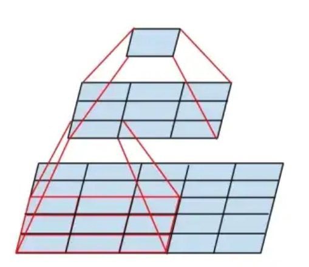
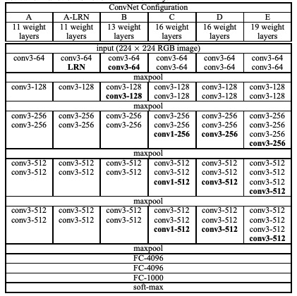

# VGG
- [paper](https://arxiv.org/abs/1409.1556)

## 一、VGG块

- 采用堆积的小卷积核
    > 对于给定的感受野，采用堆积的小卷积核优于采用大的卷积核  
    > 例如3个`3x3`的卷积核，替代`7x7`的卷积核  
    > 例如2个`3x3`的卷积核，替代`5x5`的卷积核  

- 示意图
    > 2个`3x3`的卷积核，替代`5x5`的卷积核  
    
    

- 代码实现
    ```python
    def vgg_block(num_convs, in_channels, out_channels):
        blk = []
        for i in range(num_convs):
            if i == 0:
                blk.append(nn.Conv2d(in_channels, out_channels, kernel_size=3, padding=1))  # 这里宽高不变
            else:
                blk.append(nn.Conv2d(out_channels, out_channels, kernel_size=3, padding=1))  # 这里宽高不变
            blk.append(nn.ReLU())
        blk.append(nn.MaxPool2d(kernel_size=2, stride=2))  # 这里会使宽高减半

        return nn.Sequential(*blk)
    ```

## 二、VGG_11

- 发布了多个规模的模型

    

- 以`A列`为例，`VGG_11`的代码实现
    ```python 
    class VGG_11(nn.Module):
        def __init__(self):
            super(VGG_11, self).__init__()

            conv_arch = ((1, 3, 64), (1, 64, 128), (2, 128, 256), (2, 256, 512), (2, 512, 512))
            self.conv = nn.Sequential()
            for i, (num_convs, in_channels, out_channels) in enumerate(conv_arch):
                self.conv.add_module("vgg_block_" + str(i+1), vgg_block(num_convs, in_channels, out_channels))
            
            self.fc = nn.Sequential(
                nn.Linear(512*7*7, 4096),
                nn.ReLU(),
                nn.Dropout(0.5),
                nn.Linear(4096, 4096),
                nn.ReLU(),
                nn.Dropout(0.5),
                nn.Linear(4096, 1000)
            )

        def forward(self, img):
            # img: (batch_size, 3, 224, 224)
            #      (batch_size, channel, height, width)
            feature = self.conv(img)
            output = self.fc(feature.view(img.shape[0], -1))
            return output
    ```