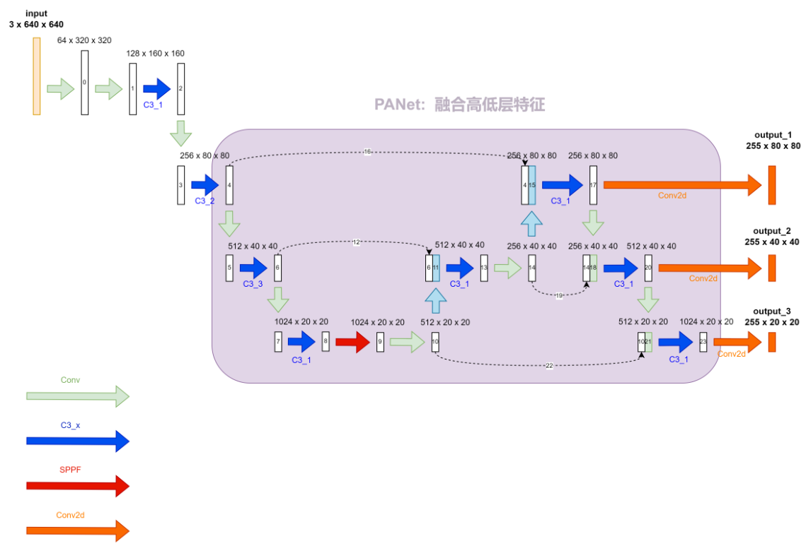

# YOLO
> 参考: https://blog.csdn.net/wjinjie/article/details/107509243  
> 这里看看yolov5s的网络结构

## 一、网络结构

<b>1. Conv</b>

<b>2. C3_x</b>

<b>3. SPP 或者 SPPF</b>

<b>4. 整个yolo模型</b>

## 二、损失函数

1. yolov5
    > todo
2. yolov8
    > 参考: https://www.vectorexplore.com/tech/computer-vision/yolov8/anchor-free.html