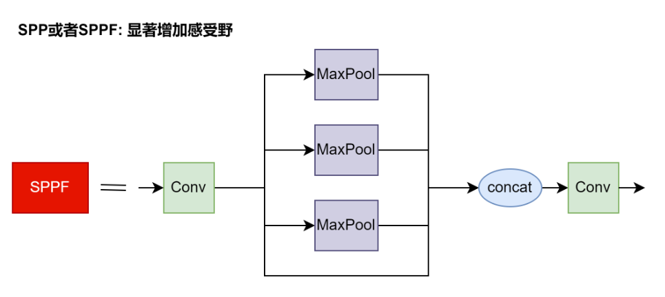

# YOLO
> 参考: https://blog.csdn.net/wjinjie/article/details/107509243  
> 这里看看yolov5s的网络结构

## 一、网络结构

<details>
<summary><b>1. Conv</b></summary>


</details>

<details>
<summary><b>2. C3_x</b></summary>


</details>

<details>
<summary><b>3. SPP 或者 SPPF</b></summary>



</details>

<details>
<summary><b>4. 整个yolo模型</b></summary>


</details>

## 二、损失函数

### yolov5

> 参考代码: https://github.com/ultralytics/yolov5/blob/master/utils/loss.ComputeLoss

1. 边界框回归，使用CIoU Loss
    ```python
    # pxy为预测的边框中心坐标
    # pwh为预测的边框宽、高
    # tbox[i] 为实际的边框
    pxy = pxy.sigmoid() * 2 - 0.5
    pwh = (pwh.sigmoid() * 2) ** 2 * anchors[i]
    pbox = torch.cat((pxy, pwh), 1)  # predicted box
    iou = bbox_iou(pbox, tbox[i], CIoU=True).squeeze()  # iou(prediction, target)
    lbox += (1.0 - iou).mean()  # iou loss
    ```
2. 边界框的分类，使用交叉熵(BCE Loss)
    ```python
    # pcls为预测的类别
    # t为实际的类别
    lcls += self.BCEcls(pcls, t)  # BCE
    ```
3. 边界框的置信度，使用交叉熵(BCE Loss)
    ```python
    tobj = torch.zeros(pi.shape[:4], dtype=pi.dtype, device=self.device)  # target obj, 初始化为0
    tobj[b, a, gj, gi] = iou  # 上面已计算出的CIoU, 作为target
    obji = self.BCEobj(pi[..., 4], tobj) # BCE
    ```

### yolov8

> 参考: https://www.vectorexplore.com/tech/computer-vision/yolov8/anchor-free.html